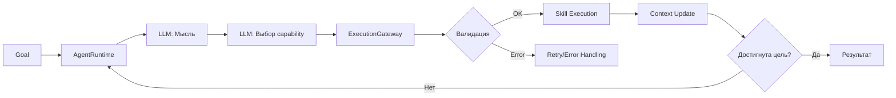

# Архитектура Проекта "Agent System"

## 🎯 **Назначение системы**
Создание модульной, расширяемой платформы для автономных AI-агентов с возможностью:
- Reasoning-циклов (ReAct)
- Планирования и выполнения задач
- Интеграции с различными LLM и базами данных
- Отслеживания состояния и контекста

---

## 🏗️ **Архитектурные слои**

### **1. Слой выполнения (Execution Layer)**
```
AgentRuntime → ExecutionGateway → Skills/Tools
```
- **AgentRuntime**: "Мозг" - управляет reasoning-циклом
- **ExecutionGateway**: "Тело" - выполняет действия, обеспечивает безопасность
- **Skills/Tools**: "Руки" - специализированные модули для конкретных задач

### **2. Слой контекста (Context Layer)**
```
SessionContext
├── DataContext (сырые данные)
└── StepContext (шаги агента)
```
Двухуровневое разделение: что произошло (данные) и как (шаги)

### **3. Слой ресурсов (Resource Layer)**
```
SystemContext → Реестр ресурсов → Провайдеры (LLM/DB)
```
Централизованное управление всеми зависимостями системы

### **4. Слой событий (Events Layer)**
```
EventBus → Event Handlers → Logging/Metrics/Audit
```
Централизованная обработка событий, заменяющая традиционное логирование

### **5. Слой валидации (Validation Layer)**
```
Structured Actions → Retry Policy → Error Handling
```
Гарантия корректности и устойчивости выполнения

---

## 🔄 **Взаимодействие компонентов**

### **Типичный поток выполнения:**
```
Пользовательская цель
    ↓
AgentRuntime.run()
    ↓
1. THINK (генерация мысли через LLM)
    ↓
2. DECIDE (выбор capability через LLM)
    ↓
3. ACT (подготовка действия)
    ↓
ExecutionGateway.execute_capability()
    ↓
   ├── Валидация Structured Actions
   ├── Поиск соответствующего Skill
   ├── Выполнение Skill (возможно с использованием Tools)
   ├── Retry Policy при ошибках
   └── Регистрация результата в Context
    ↓
4. OBSERVE (анализ результата)
    ↓
Повтор или завершение
```

---

## 📦 **Ключевые компоненты**

### **Ядро системы (core/)**

| Компонент | Ответственность | Паттерны |
|-----------|----------------|----------|
| **AgentRuntime** | Управление reasoning-циклом | Loop Pattern, Template Method |
| **ExecutionGateway** | Единая точка выполнения | Facade, Gateway Pattern |
| **SessionContext** | Управление состоянием сессии | Session State, Context Object |
| **SystemContext** | Управление ресурсами | Registry, Dependency Injection |
| **EventBus** | Централизованная обработка событий | Observer, Publisher-Subscriber |
| **Infrastructure Services** | Инфраструктурные сервисы (БД, LLM и др.) | Service Layer Pattern |
| **PromptService** | Централизованное управление промптами | Service Layer, Template Pattern |

### **Модели и типы (models/)**

| Тип | Назначение | Особенности |
|-----|------------|-------------|
| **Capability** | Декларация возможности | Pydantic модель, Schema-валидация |
| **ContextItem** | Элемент контекста | Типизированный контент, метаданные |
| **AgentStep** | Шаг агента | Ссылки на данные + метаинформация |

### **Навыки и инструменты**

| Категория | Назначение | Примеры |
|-----------|------------|---------|
| **Skills** | Логика рассуждений | PlanningSkill (планирование) |
| **Tools** | Внешние взаимодействия | DatabaseTool, APITool |

### **Провайдеры (providers/)**

| Провайдер | Назначение | Реализации |
|-----------|------------|------------|
| **LLM Provider** | Взаимодействие с LLM | VLLM, Llama.cpp |
| **DB Provider** | Взаимодействие с БД | PostgreSQL |
| **ProviderFactory** | Создание провайдеров | Factory Method |

---

## 🎭 **Архитектурные паттерны**

### **1. ReAct (Reasoning + Acting)**
```
THINK → DECIDE → ACT → OBSERVE → Повтор
```
Агент постоянно анализирует ситуацию и корректирует поведение

### **2. Двухуровневый контекст**
- **DataContext**: Append-only хранилище сырых данных (SQL-результаты, API-ответы)
- **StepContext**: Очищенные шаги агента (безопасны для LLM)

### **3. Capability-ориентированный дизайн**
```
Capability = Декларация (ЧТО можно сделать)
Skill = Реализация (КАК это сделать)
```
LLM выбирает capability → система находит соответствующий skill

### **4. Structured Actions**
```python
# Декларация схемы
class CreatePlanInput(BaseModel):
    goal: str

# Валидация перед выполнением
validator.validate(capability_name, payload)
```

### **5. Retry with Error Classification**
```
Ошибка → Классификация → Решение (RETRY/ABORT/FAIL)
              ↓
    Транзиентная? → Повторить
    Входные данные? → Прервать
    Фатальная? → Завершить
```

### **6. Registry Pattern**
```python
system.register_skill(planning_skill)
system.register_llm("gpt-4", provider)
```
Централизованное управление ресурсами

### **7. Event-Driven Architecture**
```python
# Публикация события
event_bus.publish(EventType.AGENT_CREATED, data={"agent_id": agent.id})

# Подписка на событие
event_bus.subscribe(EventType.AGENT_CREATED, handler_function)
```
Замена традиционного логирования на систему событий

### **8. PromptService (Шаблон централизованного управления промптами)**
```
Prompts хранятся в отдельной директории (prompts/)
→ Индексация при старте системы
→ Резолюция версий (по умолчанию из metadata.yaml)
→ Рендеринг с безопасной подстановкой переменных
→ Поддержка стратегий (react, plan_and_execute и др.)
→ Валидация обязательных переменных перед рендерингом
```
Централизованное управление промптами с поддержкой версионирования и безопасного рендеринга

---

## 🔗 **Связи и зависимости**

### **Прямые зависимости:**
```
AgentRuntime → ExecutionGateway → Skills → Tools
          ↓          ↓
    SessionContext  SystemContext
```

### **Обратные зависимости (через интерфейсы):**
```
Tools → BaseTool
Skills → BaseSkill
Providers → BaseLLMProvider/BaseDBProvider
```

### **Циклические зависимости (проблема):**
```
AgentRuntime → ExecutionGateway → RetryPolicy
       ↑                           ↓
    SystemContext ←───────────
```
*Требует рефакторинга*

---

## 🗂️ **Структура проекта**
```
project/
├── core/                    # Ядро системы
│   ├── agent_runtime.py     # Reasoning-цикл
│   ├── execution_gateway.py # Единая точка выполнения
│   ├── context.py          # Двухуровневый контекст
│   ├── system_context.py   # Управление ресурсами
│   ├── retry_policy.py     # Политика повторных попыток
│   ├── structured_actions.py # Валидация действий
│   ├── events/             # Система событий
│   │   ├── event_bus.py    # Шина событий
│   │   └── event_handlers.py # Обработчики событий
│   └── infrastructure/     # Инфраструктурные компоненты
│       ├── service/        # Инфраструктурные сервисы
│       │   ├── base_service.py # Базовый класс сервиса
│       │   └── table_description_service.py # Сервис описания таблиц
│       ├── providers/      # Провайдеры (LLM, DB и др.)
│       └── tools/          # Инструменты для I/O
├── models/                 # Типы данных
├── skills/                 # Навыки агента
├── tools/                  # Инструменты для I/O
├── providers/              # Адаптеры для внешних сервисов
├── prompts/                # Промпты для навыков и стратегий
│   ├── skills/             # Промпты для навыков
│   │   ├── planning/       # Промпты для планирования
│   │   └── book_library/   # Промпты для библиотечных навыков
│   ├── strategies/         # Промпты для стратегий
│   │   └── react/          # Промпты для стратегии ReAct
│   └── metadata.yaml       # Управление версиями и архивацией
└── tests/                  # Тесты всех компонентов
```

---

## 🔄 **Поток данных**

### **Входные данные:**
1. Цель пользователя
2. Конфигурация системы (LLM, БД, навыки)

### **Внутренний поток:**


### **Выходные данные:**
1. Контекст выполнения (данные + шаги)
2. Итоговый результат
3. Логи и метрики

---

## 🛡️ **Безопасность и изоляция**

### **Изоляция ответственности:**
- **AgentRuntime** не знает о конкретных skills/tools
- **Skills** не выполняют прямой I/O (только через Tools)
- **Context** не зависит от LLM
- **Gateway** проверяет все действия

### **Защитные механизмы:**
1. Валидация схемы перед выполнением
2. Retry-лимиты и таймауты
3. Изоляция LLM-промптов (безопасный StepContext)
4. Append-only DataContext (невозможно изменить историю)

---

## 📈 **Масштабируемость**

### **Вертикальное масштабирование:**
- Добавление новых Skills/Tools
- Подключение дополнительных провайдеров
- Расширение схем валидации

### **Горизонтальное масштабирование:**
- Асинхронная архитектура (все операции async/await)
- Статический SystemContext (можно реплицировать)
- Изолированные сессии агентов

---

## 🧪 **Тестируемость**

### **Уровни тестирования:**
1. **Unit-тесты**: Модели, валидаторы, политики
2. **Интеграционные тесты**: Провайдеры, Skills
3. **E2E-тесты**: Полный цикл AgentRuntime

### **Моки и стабы:**
- LLM-провайдеры мокаются для тестов
- DB-провайдеры используют in-memory БД
- Skills тестируются с заглушенными зависимостями

---

## 🔒 **Защита от попадания нежелательных файлов в репозиторий**

Для защиты от попадания нежелательных файлов в репозиторий используется файл `.gitignore`, который игнорирует:
- Временные файлы и директории (`*.tmp`, `*.temp`, `tmp/`, `temp/`)
- Лог-файлы и директории (`logs/`)
- Файлы настроек IDE (`.vscode/`, `.idea/`, `*.swp`, `*.swo`)
- Виртуальные окружения (`venv/`, `env/`, `.venv/`, `.env`)
- Файлы с секретами и конфигурациями (`*.secrets`, `.env*`, `config/secrets.*`)
- Кэш-файлы (`__pycache__/`, `.pytest_cache/`, `.hypothesis/`, `*.pyc`)
- Файлы данных и модели (`*.csv`, `*.json`, `*.db`, `models/trained/`, `data/`)
- Файлы Jupyter Notebook checkpoints (`.ipynb_checkpoints/`)
- Системные файлы ОС (`.DS_Store`, `Thumbs.db`, `desktop.ini`)

Также предусмотрен файл `.qwenignore` для исключения файлов из индексации системой Qwen Code.

---

## 🚨 **Точки расширения**

### **Плагинная архитектура:**
```python
# Регистрация нового skill
system.register_skill(CustomSkill())

# Добавление новой capability
skill.get_capabilities().append(new_capability)

# Подключение нового провайдера
factory.create_llm_provider("new_backend", config)
```

### **Конфигурация:**
- Параметры LLM (temperature, tokens)
- Retry-политики (количество попыток, задержки)
- TTL сессий
- Лимиты выполнения

---

## 🎖️ **Сильные стороны архитектуры**

1. **Чистое разделение ответственности** - каждый компонент делает одно дело
2. **Асинхронность первого класса** - оптимально для I/O операций
3. **Capability-ориентированный подход** - гибкий выбор действий
4. **Двухуровневый контекст** - безопасность + детализация
5. **Structured validation** - надежность выполнения
6. **Централизованное управление ошибками** - единая точка failure handling
7. **Тестовое покрытие** - все ключевые компоненты протестированы
8. **Система событий (Event Bus)** - замена традиционного логирования, обеспечение гибкости и расширяемости

---

## ⚠️ **Архитектурные риски**

1. **Циклические зависимости** между компонентами
2. **Потенциальные deadlocks** из-за смешения threading и asyncio
3. **Отсутствие миграций БД** для persistence слоя
4. **Нет механизма версионирования** схем и capabilities
5. **Ограниченный мониторинг** и observability

---

## 🔮 **Эволюция архитектуры**

### **Текущая версия**: Модульный монолит
- Все компоненты в одном процессе
- Общая память для контекста
- Прямые вызовы между модулями

### **Будущие возможности**:
1. **Микросервисная декомпозиция**
   - Выделение AgentRuntime в отдельный сервис
   - Skills как независимые сервисы
   - Централизованный Context Service

2. **Event-driven архитектура**
   - Шины событий для взаимодействия компонентов
   - Асинхронная обработка long-running задач
   - Saga pattern для распределенных транзакций

3. **Полигоны тестирования**
   - A/B тестирование промптов
   - Shadow testing навыков
   - Canary deployment агентов

---

## 📚 **Ключевые выводы**

Проект демонстрирует **зрелую инженерную культуру** с:
- Четким разделением ответственности
- Продуманной системой валидации и обработки ошибок
- Гибкой архитектурой для расширения
- Хорошим тестовым покрытием

**Рекомендуется**:
1. Исправить критические проблемы (deadlocks, циклические зависимости)
2. Добавить полноценное логирование и мониторинг
3. Внедрить механизм миграций для persistence
4. Рассмотреть event-driven подход для масштабирования

**Архитектура** балансирует между **практичностью** (работает сейчас) и **расширяемостью** (можно развивать), что делает ее отличной основой для production-системы автономных агентов.

---

## 🤖 **Использование PromptService**

### **Пример использования в навыках:**
```python
# В конструкторе навыка
def __init__(self, name: str, system_context: BaseSystemContext, **kwargs):
    super().__init__(name, system_context, **kwargs)
    self.prompt_service = system_context.get_resource("prompt_service")  # Получение сервиса

# В методе выполнения
async def _create_plan(self, parameters: Dict[str, Any], context: BaseSessionContext) -> ExecutionResult:
    # ИСПОЛЬЗУЕМ СЕРВИС:
    prompt = await self.prompt_service.render(
        capability_name="planning.create_plan",
        variables={
            "goal": goal,
            "max_steps": input_data.max_steps,
            "capabilities_list": self._get_capabilities_list(),
            "context": input_data.context or context.get_summary()
        }
    )
    # ... остальная логика
```

### **Формат файла промпта:**
```yaml
# === МЕТАДАННЫЕ ===
version: "1.2.0"              # Версия в метаданных (дублирует имя файла)
skill: "planning"             # Навык-владелец
capability: "planning.create_plan"  # Capability для которой предназначен
strategy: null                # null = для всех стратегий, или "react", "plan_and_execute"
role: "system"                # system/user/assistant
language: "ru"                # Язык (всегда "ru" — без локализации)
tags: 
  - "planning"
  - "initial"
  - "structured_output"
variables:                    # Обязательные переменные для рендеринга
  - "goal"
  - "max_steps"
  - "capabilities_list"
  - "context"
# ... остальные метаданные

# === САМ ПРОМПТ ===
content: |
  Ты — модуль планирования агентной системы.
  Твоя задача — создать ПЕРВИЧНЫЙ план действий для достижения цели.
  
  ДОСТУПНЫЕ ВОЗМОЖНОСТИ СИСТЕМЫ:
  {{ capabilities_list }}
  
  ИНСТРУКЦИИ:
  1. СТРОЙ план с нуля на основе цели
  2. ДЕЛИ план на конкретные, выполнимые шаги
  3. УЧИТЫВАЙ доступные возможности системы при выборе действий
  4. ДЕЛАЙ шаги последовательными и логичными
  5. УКАЖИ реалистичные оценки времени для каждого шага
  6. УЧИТЫВАЙ ограничения системы (максимум {{ max_steps }} шагов)
  
  ЦЕЛЬ:
  {{ goal }}
  
  ДОПОЛНИТЕЛЬНЫЙ КОНТЕКСТ:
  {{ context }}
```

### **Преимущества использования:**
1. **Централизованное управление** - все промпты в одной директории
2. **Версионирование** - поддержка разных версий промптов
3. **Безопасный рендеринг** - защита от небезопасной подстановки переменных
4. **Валидация переменных** - проверка обязательных переменных перед рендерингом
5. **Поддержка стратегий** - разные промпты для разных стратегий выполнения
6. **Горячая перезагрузка** - возможность обновления промптов без перезапуска системы