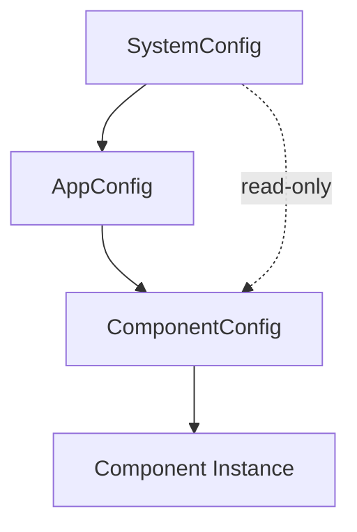

# ⚙️ Руководство по конфигурации Agent_v5

> **Версия:** 5.1.0  
> **Дата обновления:** 2026-02-17  
> **Статус:** approved  
> **Владелец:** @system

---

## 📋 Оглавление
- [Обзор](#-обзор)
- [Система конфигурации](#-система-конфигурации)
- [Файлы конфигурации](#-файлы-конфигурации)
- [Профили окружения](#-профили-окружения)
- [Конфигурация компонентов](#-конфигурация-компонентов)
- [Переменные окружения](#-переменные-окружения)
- [Валидация конфигурации](#-валидация-конфигурации)

---

## 🔍 Обзор

Система конфигурации Agent_v5 использует YAML-файлы с поддержкой разных профилей окружения, переменных окружения и версионирования ресурсов.

### Назначение
- **Гибкость**: Разные конфигурации для dev/test/prod
- **Безопасность**: Разделение секретов и публичных настроек
- **Версионирование**: Управление версиями промптов и контрактов
- **Изоляция**: Разделение глобальной и компонентной конфигурации

### Ключевые возможности
- ✅ **Профили**: dev, test, prod с разными настройками
- ✅ **Переменные окружения**: Подстановка значений из окружения
- ✅ **Версионирование**: Версии промптов, контрактов, паттернов
- ✅ **Валидация**: Автоматическая проверка конфигурации

---

## 🏗️ Система конфигурации

### Уровни конфигурации



### Типы конфигурации

| Тип | Класс | Источник | Назначение |
|-----|-------|----------|------------|
| **SystemConfig** | `SystemConfig` | `core/config/defaults/{profile}.yaml` | Инфраструктура, провайдеры |
| **AppConfig** | `AppConfig` | `data/registry.yaml` | Глобальные настройки приложения |
| **ComponentConfig** | `ComponentConfig` | Генерируется из AppConfig | Конфигурация конкретного компонента |

### Загрузка конфигурации

```python
from core.config import get_config

# Загрузка конфигурации по профилю
config = get_config(profile="prod")

# Доступ к настройкам
log_level = config.log_level
llm_provider = config.providers.llm.provider_type
```

---

## 📄 Файлы конфигурации

### registry.yaml

Основной файл конфигурации приложения.

```yaml
# data/registry.yaml

# Профиль окружения
profile: prod

# Поведения (Behavior Patterns)
behaviors:
  react_pattern:
    enabled: true
    dependencies: []
    parameters:
      max_thoughts: 5
    prompt_versions:
      behavior.react.think: v1.0.0
      behavior.react.act: v1.0.0
      behavior.react.observe: v1.0.0
    input_contract_versions:
      behavior.react.think: v1.0.0
    output_contract_versions:
      behavior.react.think: v1.0.0
    manifest_path: data/manifests/behaviors/react_pattern/manifest.yaml

# Сервисы
services:
  prompt_service:
    enabled: true
    dependencies: []
    prompt_versions:
      prompt_service.get_prompt: v1.0.0
    input_contract_versions:
      prompt_service.get_prompt: v1.0.0
    output_contract_versions:
      prompt_service.get_prompt: v1.0.0
    manifest_path: data/manifests/services/prompt_service/manifest.yaml

  sql_generation_service:
    enabled: true
    dependencies: []
    parameters:
      max_retries: 3
      timeout: 30
    prompt_versions:
      sql_generation.generate_query: v1.0.0
    manifest_path: data/manifests/services/sql_generation_service/manifest.yaml

# Навыки
skills:
  planning:
    enabled: true
    dependencies:
      - prompt_service
    prompt_versions:
      planning.create_plan: v1.0.0
    manifest_path: data/manifests/skills/planning/manifest.yaml

# Типы возможностей
capability_types:
  behavior: behavior
  behavior.react: behavior
  behavior.react.think: behavior
  prompt_service.get_prompt: service
  planning.create_plan: skill
```

### Базовая конфигурация

```yaml
# core/config/defaults/base.yaml

profile: dev
log_level: DEBUG
log_dir: logs

providers:
  llm:
    provider_type: llama_cpp
    model_name: mistral-7b-instruct-v0.2
    parameters:
      n_ctx: 4096
      n_threads: 4
  
  database:
    provider_type: mock
    parameters:
      mock_data_path: data/mock_db

agent:
  max_steps: 10
  timeout: 300
  sandbox_mode: false
```

### Конфигурация разработки

```yaml
# core/config/defaults/dev.yaml

profile: dev
log_level: DEBUG

providers:
  llm:
    provider_type: llama_cpp
    parameters:
      n_ctx: 2048  # Меньший контекст для скорости
  
  database:
    provider_type: mock  # Mock БД для разработки

agent:
  max_steps: 5  # Меньше шагов для отладки
  sandbox_mode: false  # Разрешить побочные эффекты
```

### Конфигурация продакшена

```yaml
# core/config/defaults/prod.yaml

profile: prod
log_level: INFO

providers:
  llm:
    provider_type: vllm
    parameters:
      n_ctx: 8192
      tensor_parallel_size: 2
      gpu_memory_utilization: 0.9
  
  database:
    provider_type: postgres
    parameters:
      host: ${DB_HOST}
      port: ${DB_PORT|5432}
      database: ${DB_NAME}
      user: ${DB_USER}
      password: ${DB_PASSWORD}

agent:
  max_steps: 20
  timeout: 600
  sandbox_mode: false
```

---

## 🔄 Профили окружения

### Доступные профили

| Профиль | Назначение | Версии | Побочные эффекты |
|---------|------------|--------|------------------|
| **dev** | Разработка | active, draft | Разрешены |
| **test** | Тестирование | active | Разрешены (mock) |
| **prod** | Продакшен | active | Разрешены |
| **sandbox** | Песочница | все | Заблокированы |

### Переключение профиля

```bash
# Через переменную окружения
export AGENT_PROFILE=prod
python main.py

# Через аргумент командной строки
python main.py --profile=prod

# Через конфигурацию
python main.py --config-path=./configs/production.yaml
```

### Проверка профиля в коде

```python
from core.config import get_config

config = get_config()

if config.profile == "prod":
    # Продакшен-логика
    assert component.config.status == "active"
elif config.profile == "sandbox":
    # Sandbox-логика
    enable_sandbox_restrictions()
```

---

## 🧩 Конфигурация компонентов

### ComponentConfig

Конфигурация создаётся для каждого компонента индивидуально:

```python
from core.config.component_config import ComponentConfig

class ComponentConfig:
    """Конфигурация компонента"""
    
    # Версии ресурсов
    prompt_versions: Dict[str, str] = {}
    input_contract_versions: Dict[str, str] = {}
    output_contract_versions: Dict[str, str] = {}
    
    # Параметры компонента
    parameters: Dict[str, Any] = {}
    
    # Изоляция файлового доступа
    base_path: str = ""
    
    # Статус версии
    status: str = "active"
```

### Получение ComponentConfig

```python
# Внутри ApplicationContext
component_config = app_context.get_component_config("sql_generation_service")

# Доступ к параметрам
max_retries = component_config.parameters.get("max_retries", 3)
timeout = component_config.parameters.get("timeout", 30)

# Доступ к версиям ресурсов
prompt_version = component_config.prompt_versions["sql_generation.generate_query"]
```

### Переопределение версий (A/B тестирование)

```yaml
# registry.yaml
services:
  sql_generation_service:
    # Базовая версия
    prompt_versions:
      sql_generation.generate_query: v1.0.0
    
    # Переопределение для sandbox (A/B тестирование)
    overrides:
      sandbox:
        prompt_versions:
          sql_generation.generate_query: v2.0.0-draft
```

---

## 🔐 Переменные окружения

### Синтаксис

```yaml
providers:
  database:
    parameters:
      # Простая подстановка
      host: ${DB_HOST}
      
      # Значение по умолчанию
      port: ${DB_PORT|5432}
      
      # Путь к файлу
      password_file: ${DB_PASSWORD_FILE|/run/secrets/db_password}
```

### Поддерживаемые форматы

| Формат | Пример | Описание |
|--------|--------|----------|
| `${VAR}` | `${DB_HOST}` | Обязательная переменная |
| `${VAR\|default}` | `${DB_PORT\|5432}` | Переменная со значением по умолчанию |
| `${VAR\|/path}` | `${CONFIG_PATH\|./config}` | Путь по умолчанию |

### Загрузка переменных

```python
from core.config.config_loader import load_env_variables

config_dict = load_yaml("registry.yaml")
config_dict = load_env_variables(config_dict)
```

### Пример .env файла

```bash
# .env (не добавлять в репозиторий!)

# База данных
DB_HOST=localhost
DB_PORT=5432
DB_NAME=agent_db
DB_USER=agent
DB_PASSWORD=secret_password

# LLM провайдер
LLM_API_KEY=your_api_key_here
LLM_MODEL=mistral-7b-instruct-v0.2

# Логирование
LOG_LEVEL=INFO
LOG_DIR=/var/log/agent
```

---

## ✅ Валидация конфигурации

### Автоматическая валидация

```python
from core.config.config_validator import validate_config

try:
    validate_config(config)
except ConfigurationError as e:
    print(f"Ошибка конфигурации: {e}")
```

### Проверки валидации

| Проверка | Описание |
|----------|----------|
| **Существование файлов** | Манифесты, промпты, контракты существуют |
| **Версии ресурсов** | Версии существуют в хранилище |
| **Зависимости** | Зависимые компоненты включены |
| **Статусы версий** | Prod принимает только active версии |
| **Типы провайдеров** | provider_type корректен |

### Валидация при запуске

```bash
# Проверка конфигурации
python scripts/validate_registry.py

# Проверка манифестов
python scripts/validate_all_manifests.py

# Проверка YAML-синтаксиса
python scripts/check_yaml_syntax.py
```

### Обработка ошибок

```python
from core.config import get_config
from core.models.errors.architecture_violation import ConfigurationError

try:
    config = get_config(profile="prod")
except ConfigurationError as e:
    # Логирование ошибки
    logger.error(f"Configuration error: {e}")
    
    # Fallback на dev профиль
    config = get_config(profile="dev")
```

---

## 🔧 Динамическое обновление

### Горячая перезагрузка конфигурации

```python
from core.config.config_loader import reload_config

# Перезагрузка конфигурации
new_config = reload_config()

# Применение к компонентам
for component in components:
    await component.reload_config(new_config)
```

### Обновление версий ресурсов

```python
# Обновление версии промта
component.config.prompt_versions["my_prompt"] = "v2.0.0"

# Перезагрузка кэша
await component.reload_prompts()
```

---

## 📊 Примеры конфигураций

### Минимальная конфигурация

```yaml
# minimal_registry.yaml
profile: dev

behaviors:
  react_pattern:
    enabled: true
    manifest_path: data/manifests/behaviors/react_pattern/manifest.yaml

services:
  prompt_service:
    enabled: true
    manifest_path: data/manifests/services/prompt_service/manifest.yaml
```

### Полная конфигурация

```yaml
# registry.yaml (полный пример)
profile: prod

behaviors:
  react_pattern:
    enabled: true
    dependencies: []
    parameters:
      max_thoughts: 5
    prompt_versions:
      behavior.react.think: v1.0.0
      behavior.react.act: v1.0.0
      behavior.react.observe: v1.0.0
    input_contract_versions:
      behavior.react.think: v1.0.0
    output_contract_versions:
      behavior.react.think: v1.0.0
    manifest_path: data/manifests/behaviors/react_pattern/manifest.yaml

  planning_pattern:
    enabled: true
    dependencies: []
    prompt_versions:
      behavior.planning.decompose: v1.0.0
    manifest_path: data/manifests/behaviors/planning_pattern/manifest.yaml

services:
  prompt_service:
    enabled: true
    dependencies: []
    manifest_path: data/manifests/services/prompt_service/manifest.yaml

  contract_service:
    enabled: true
    dependencies: []
    manifest_path: data/manifests/services/contract_service/manifest.yaml

  sql_generation_service:
    enabled: true
    dependencies: []
    parameters:
      max_retries: 3
      timeout: 30
    prompt_versions:
      sql_generation.generate_query: v1.0.0
    manifest_path: data/manifests/services/sql_generation_service/manifest.yaml

  sql_query_service:
    enabled: true
    dependencies: []
    manifest_path: data/manifests/services/sql_query_service/manifest.yaml

  sql_validator_service:
    enabled: true
    dependencies: []
    manifest_path: data/manifests/services/sql_validator_service/manifest.yaml

skills:
  planning:
    enabled: true
    dependencies:
      - prompt_service
    prompt_versions:
      planning.create_plan: v1.0.0
    manifest_path: data/manifests/skills/planning/manifest.yaml

  final_answer:
    enabled: true
    dependencies: []
    prompt_versions:
      final_answer.generate: v1.0.0
    manifest_path: data/manifests/skills/final_answer/manifest.yaml

  book_library:
    enabled: true
    dependencies: []
    prompt_versions:
      book_library.search_books: v1.0.0
    manifest_path: data/manifests/skills/book_library/manifest.yaml

capability_types:
  behavior: behavior
  behavior.react: behavior
  behavior.react.think: behavior
  behavior.react.act: behavior
  behavior.react.observe: behavior
  behavior.planning: behavior
  behavior.planning.decompose: behavior
  prompt_service.get_prompt: service
  contract_service.validate: service
  sql_generation.generate_query: service
  sql_query_service.execute: service
  sql_validator_service.validate: service
  planning.create_plan: skill
  final_answer.generate: skill
  book_library.search_books: skill
```

---

## 🔗 Ссылки

### Документы
- [Обзор архитектуры](./ARCHITECTURE_OVERVIEW.md)
- [Руководство по компонентам](./COMPONENTS_GUIDE.md)
- [Развёртывание](./DEPLOYMENT_GUIDE.md)

### Код
- [ConfigLoader](../core/config/config_loader.py)
- [AppConfig](../core/config/app_config.py)
- [ComponentConfig](../core/config/component_config.py)
- [ConfigValidator](../core/config/config_validator.py)

### Скрипты
- [validate_registry.py](../scripts/validate_registry.py)
- [validate_all_manifests.py](../scripts/validate_all_manifests.py)

---

*Документ автоматически сгенерирован. Не редактируйте вручную.*
