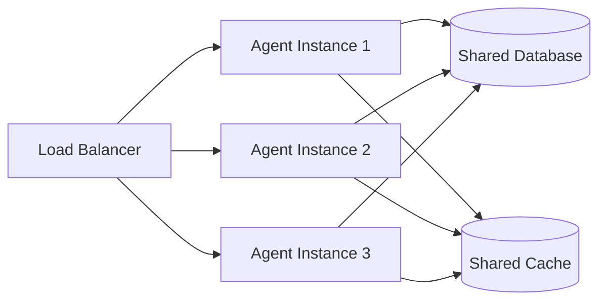

# 🚀 Руководство по развёртыванию Agent_v5

> **Версия:** 5.1.0  
> **Дата обновления:** 2026-02-17  
> **Статус:** approved  
> **Владелец:** @system

---

## 📋 Оглавление
- [Обзор](#-обзор)
- [Требования](#-требования)
- [Установка](#-установка)
- [Конфигурация](#-конфигурация)
- [Запуск](#-запуск)
- [Развёртывание в production](#-развёртывание-в-production)
- [Мониторинг](#-мониторинг)
- [Масштабирование](#-масштабирование)

---

## 🔍 Обзор

Руководство описывает процесс развёртывания Agent_v5 в различных окружениях: от локальной разработки до production-кластера.

### Назначение
- **Локальная разработка**: Быстрый старт для разработчиков
- **Тестирование**: Развёртывание тестового окружения
- **Production**: Надёжное развёртывание с мониторингом

### Ключевые возможности
- ✅ **Docker**: Контейнеризация для консистентности
- ✅ **Профили**: Разные конфигурации для dev/test/prod
- ✅ **Масштабирование**: Горизонтальное масштабирование агентов
- ✅ **Мониторинг**: Метрики, логи, трейсинг

---

## 📦 Требования

### Минимальные требования

| Компонент | Требование |
|-----------|------------|
| **CPU** | 4 ядра |
| **RAM** | 8 ГБ |
| **Disk** | 10 ГБ |
| **Python** | 3.10+ |

### Рекомендуемые требования

| Компонент | Требование |
|-----------|------------|
| **CPU** | 8+ ядер |
| **RAM** | 16+ ГБ |
| **Disk** | 50+ ГБ SSD |
| **GPU** | NVIDIA с 8+ ГБ VRAM (опционально) |

### Зависимости

```bash
# Python зависимости
python >= 3.10
pip >= 22.0

# Системные зависимости (Ubuntu/Debian)
build-essential
libpq-dev
python3-dev
libsqlite3-dev

# Для LLM провайдеров
cmake
cuda-toolkit (опционально)
```

---

## 🛠️ Установка

### Клонирование репозитория

```bash
git clone <repository_url>
cd Agent_v5
```

### Создание виртуального окружения

```bash
# Создание
python -m venv venv

# Активация (Linux/macOS)
source venv/bin/activate

# Активация (Windows)
venv\Scripts\activate
```

### Установка зависимостей

```bash
# Базовые зависимости
pip install -r requirements.txt

# Зависимости для разработки
pip install -r requirements-dev.txt

# Зависимости для production
pip install -r requirements-prod.txt
```

### Структура зависимостей

```txt
# requirements.txt
pydantic>=2.0.0
pyyaml>=6.0
aiohttp>=3.8.0
sqlalchemy>=2.0.0
psycopg2-binary>=2.9.0

# requirements-dev.txt
-r requirements.txt
pytest>=7.0.0
pytest-asyncio>=0.21.0
pytest-cov>=4.0.0
black>=23.0.0
ruff>=0.1.0
mypy>=1.0.0

# requirements-prod.txt
-r requirements.txt
gunicorn>=21.0.0
uvicorn>=0.23.0
prometheus-client>=0.17.0
structlog>=23.0.0
```

---

## ⚙️ Конфигурация

### Базовая настройка

```bash
# Копирование шаблона конфигурации
cp .env.example .env

# Редактирование конфигурации
nano .env
```

### Пример .env

```bash
# .env

# Профиль окружения
AGENT_PROFILE=prod

# База данных
DB_HOST=localhost
DB_PORT=5432
DB_NAME=agent_db
DB_USER=agent
DB_PASSWORD=secure_password_here

# LLM провайдер
LLM_PROVIDER_TYPE=vllm
LLM_MODEL=mistral-7b-instruct-v0.2
LLM_API_KEY=your_api_key

# Логирование
LOG_LEVEL=INFO
LOG_DIR=/var/log/agent

# Безопасность
SECRET_KEY=generate_secure_random_string
SANDBOX_MODE=false
```

### Конфигурация профилей

```bash
# Development
cp core/config/defaults/dev.yaml core/config/defaults/local.yaml

# Production
cp core/config/defaults/prod.yaml core/config/defaults/production.yaml
```

### Валидация конфигурации

```bash
# Проверка registry.yaml
python scripts/validate_registry.py

# Проверка манифестов
python scripts/validate_all_manifests.py

# Проверка YAML-синтаксиса
python scripts/check_yaml_syntax.py
```

---

## ▶️ Запуск

### Локальный запуск

```bash
# Базовый запуск
python main.py

# Запуск с вопросом
python main.py "Проанализируй рынок ИИ"

# Запуск с профилем
python main.py --profile=dev

# Запуск с отладкой
python main.py --debug --log-level=DEBUG

# Запуск с ограничением шагов
python main.py --max-steps=5
```

### Запуск через скрипт

```bash
# Скрипт запуска агента
python run_agent.py

# С кастомной конфигурацией
python run_agent.py --config=./configs/production.yaml
```

### Запуск тестов

```bash
# Все тесты
python -m pytest tests/ -v

# Юнит-тесты
python -m pytest tests/unit/ -v

# Интеграционные тесты
python -m pytest tests/integration/ -v

# С покрытием
python -m pytest tests/ --cov=core --cov-report=html
```

### Docker запуск

```bash
# Сборка образа
docker build -t agent_v5:latest .

# Запуск контейнера
docker run -it --rm \
  -e AGENT_PROFILE=prod \
  -e DB_HOST=db \
  -e DB_PASSWORD=secret \
  agent_v5:latest

# С томами для данных
docker run -it --rm \
  -v $(pwd)/data:/app/data \
  -v $(pwd)/logs:/app/logs \
  agent_v5:latest
```

### Docker Compose

```yaml
# docker-compose.yaml
version: '3.8'

services:
  agent:
    build: .
    environment:
      - AGENT_PROFILE=prod
      - DB_HOST=db
      - DB_PASSWORD=${DB_PASSWORD}
    volumes:
      - ./data:/app/data
      - ./logs:/app/logs
    depends_on:
      - db
  
  db:
    image: postgres:15
    environment:
      - POSTGRES_DB=agent_db
      - POSTGRES_USER=agent
      - POSTGRES_PASSWORD=${DB_PASSWORD}
    volumes:
      - postgres_data:/var/lib/postgresql/data

volumes:
  postgres_data:
```

```bash
# Запуск через docker-compose
docker-compose up -d

# Просмотр логов
docker-compose logs -f agent

# Остановка
docker-compose down
```

---

## 🌐 Развёртывание в production

### Подготовка сервера

```bash
# Обновление системы
sudo apt update && sudo apt upgrade -y

# Установка зависимостей
sudo apt install -y python3.10 python3.10-venv python3-pip
sudo apt install -y postgresql-client libpq-dev
sudo apt install -y nginx supervisor

# Создание пользователя
sudo useradd -m -s /bin/bash agent
sudo su - agent
```

### Установка приложения

```bash
# Клонирование
git clone <repository_url> ~/agent_v5
cd ~/agent_v5

# Виртуальное окружение
python3 -m venv venv
source venv/bin/activate

# Установка зависимостей
pip install -r requirements-prod.txt
```

### Настройка базы данных

```bash
# Создание БД
sudo -u postgres psql << EOF
CREATE DATABASE agent_db;
CREATE USER agent WITH PASSWORD 'secure_password';
GRANT ALL PRIVILEGES ON DATABASE agent_db TO agent;
EOF
```

### Настройка supervisor

```ini
# /etc/supervisor/conf.d/agent.conf
[program:agent]
command=/home/agent/agent_v5/venv/bin/python /home/agent/agent_v5/main.py
directory=/home/agent/agent_v5
user=agent
autostart=true
autorestart=true
redirect_stderr=true
stdout_logfile=/var/log/agent/agent.out.log
stderr_logfile=/var/log/agent/agent.err.log
environment=AGENT_PROFILE="prod",DB_HOST="localhost"
```

```bash
# Перезапуск supervisor
sudo supervisorctl reread
sudo supervisorctl update
sudo supervisorctl start agent
```

### Настройка nginx

```nginx
# /etc/nginx/sites-available/agent
server {
    listen 80;
    server_name agent.example.com;

    location / {
        proxy_pass http://127.0.0.1:8000;
        proxy_set_header Host $host;
        proxy_set_header X-Real-IP $remote_addr;
        proxy_set_header X-Forwarded-For $proxy_add_x_forwarded_for;
    }

    location /health {
        return 200 'OK';
        add_header Content-Type text/plain;
    }
}
```

```bash
# Включение конфигурации
sudo ln -s /etc/nginx/sites-available/agent /etc/nginx/sites-enabled/
sudo nginx -t
sudo systemctl reload nginx
```

### SSL/TLS настройка

```bash
# Установка certbot
sudo apt install -y certbot python3-certbot-nginx

# Получение сертификата
sudo certbot --nginx -d agent.example.com

# Автообновление
sudo systemctl enable certbot.timer
```

---

## 📊 Мониторинг

### Логирование

```python
# Структурированное логирование
import structlog

logger = structlog.get_logger()

logger.info(
    "agent_step_executed",
    step_id=step_id,
    capability=capability,
    duration_ms=duration
)
```

### Настройка логирования

```yaml
# logging.yaml
version: 1
formatters:
  json:
    class: pythonjsonlogger.jsonlogger.JsonFormatter
    format: "%(asctime)s %(name)s %(levelname)s %(message)s"

handlers:
  console:
    class: logging.StreamHandler
    formatter: json
    level: INFO

  file:
    class: logging.handlers.RotatingFileHandler
    formatter: json
    level: DEBUG
    filename: /var/log/agent/agent.log
    maxBytes: 10485760
    backupCount: 5

root:
  level: INFO
  handlers: [console, file]
```

### Метрики

```python
from prometheus_client import Counter, Histogram, Gauge

# Метрики
AGENT_STEPS = Counter('agent_steps_total', 'Total agent steps', ['capability'])
STEP_DURATION = Histogram('agent_step_duration_seconds', 'Step duration')
ACTIVE_AGENTS = Gauge('active_agents', 'Number of active agents')

# Обновление метрик
@STEP_DURATION.time()
async def execute_step(capability: str):
    AGENT_STEPS.labels(capability=capability).inc()
    # ... логика шага
```

### Health checks

```python
from fastapi import FastAPI

app = FastAPI()

@app.get("/health")
async def health_check():
    return {
        "status": "healthy",
        "version": "5.1.0",
        "profile": config.profile
    }

@app.get("/ready")
async def readiness_check():
    # Проверка зависимостей
    db_ok = await check_database()
    llm_ok = await check_llm_provider()
    
    return {
        "ready": db_ok and llm_ok,
        "database": db_ok,
        "llm": llm_ok
    }
```

---

## 📈 Масштабирование

### Горизонтальное масштабирование



### Kubernetes развёртывание

```yaml
# k8s/deployment.yaml
apiVersion: apps/v1
kind: Deployment
metadata:
  name: agent-v5
spec:
  replicas: 3
  selector:
    matchLabels:
      app: agent-v5
  template:
    metadata:
      labels:
        app: agent-v5
    spec:
      containers:
      - name: agent
        image: agent_v5:latest
        env:
        - name: AGENT_PROFILE
          value: "prod"
        - name: DB_HOST
          valueFrom:
            secretKeyRef:
              name: db-secret
              key: host
        resources:
          requests:
            memory: "1Gi"
            cpu: "500m"
          limits:
            memory: "2Gi"
            cpu: "1000m"
        livenessProbe:
          httpGet:
            path: /health
            port: 8000
          initialDelaySeconds: 30
          periodSeconds: 10
```

```yaml
# k8s/service.yaml
apiVersion: v1
kind: Service
metadata:
  name: agent-v5-service
spec:
  selector:
    app: agent-v5
  ports:
  - port: 80
    targetPort: 8000
  type: LoadBalancer
```

### Автоскейлинг

```yaml
# k8s/hpa.yaml
apiVersion: autoscaling/v2
kind: HorizontalPodAutoscaler
metadata:
  name: agent-v5-hpa
spec:
  scaleTargetRef:
    apiVersion: apps/v1
    kind: Deployment
    name: agent-v5
  minReplicas: 2
  maxReplicas: 10
  metrics:
  - type: Resource
    resource:
      name: cpu
      target:
        type: Utilization
        averageUtilization: 70
  - type: Resource
    resource:
      name: memory
      target:
        type: Utilization
        averageUtilization: 80
```

---

## 🔧 Troubleshooting

### Частые проблемы

| Проблема | Решение |
|----------|---------|
| **Ошибка подключения к БД** | Проверьте переменные окружения DB_* |
| **Модель LLM не загружается** | Проверьте путь к модели и доступную память |
| **Агент не отвечает** | Проверьте логи в /var/log/agent/ |
| **Высокое потребление памяти** | Уменьшите n_ctx или увеличьте лимиты |

### Диагностика

```bash
# Проверка статуса
sudo supervisorctl status agent

# Просмотр логов
tail -f /var/log/agent/agent.log

# Проверка портов
netstat -tlnp | grep :8000

# Проверка памяти
ps aux | grep agent

# Проверка БД
psql -h localhost -U agent -d agent_db -c "SELECT 1"
```

---

## 🔗 Ссылки

### Документы
- [Конфигурация](./CONFIGURATION_MANUAL.md)
- [Устранение неполадок](./TROUBLESHOOTING.md)
- [Масштабируемость](./architecture/scalability.md)

### Код
- [main.py](../main.py)
- [run_agent.py](../run_agent.py)
- [config_loader.py](../core/config/config_loader.py)

### Скрипты
- [validate_registry.py](../scripts/validate_registry.py)

---

*Документ автоматически сгенерирован. Не редактируйте вручную.*
