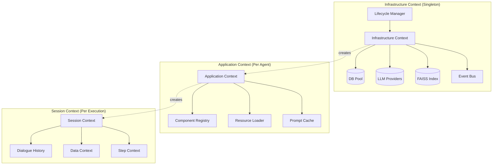
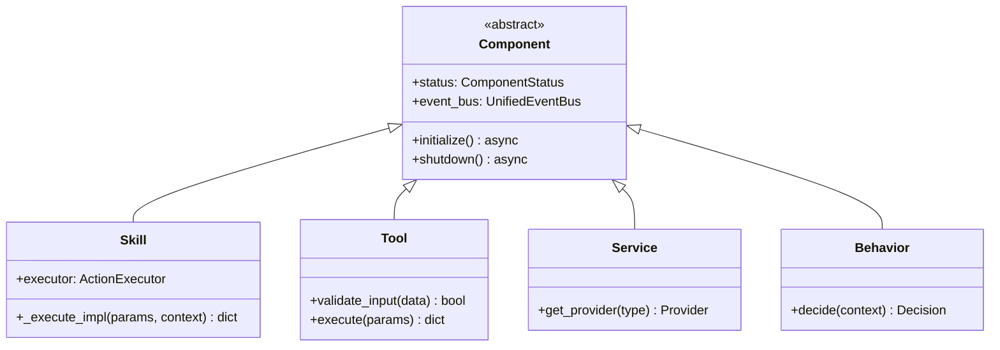
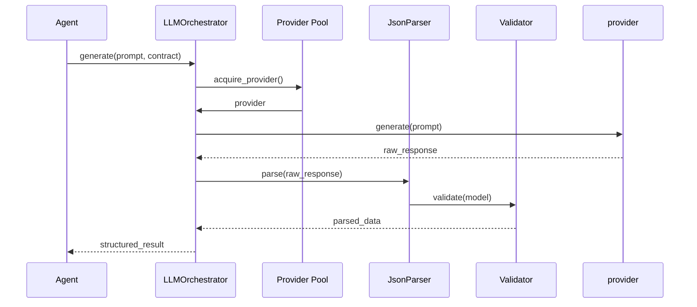
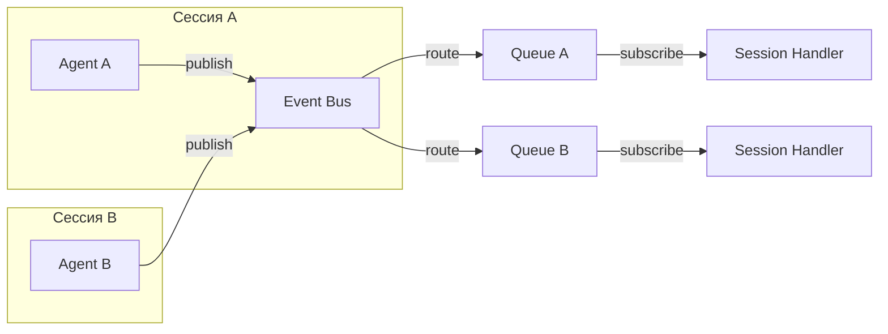

# Koru-Agent (Agent_v5)

---

## 1. Введение. Почему не «ещё один обёрточный фреймворк»»?

### Проблема индустрии

Современные LLM-фреймворки (LangChain, AutoGen, CrewAI) проектировались для быстрого прототипирования и исследовательских задач. Однако при попытке перенести их в production возникают системные проблемы:

| Проблема | Описание | Последствия |
|----------|----------|-------------|
| **Spaghetti-вызовы** | LangChain позволяет произвольные цепочки вызовов без видимой структуры | Невозможность отладки, «магические» ошибки через 50 вызовов |
| **Глобальное состояние** | AutoGen хранит состояние агентов в памяти процесса | Утечки памяти, невозможность горизонтального масштабирования |
| **Слабая валидация** | JSON-парсинг часто падает, retry на уровне промпта | Непредсказуемое поведение, «почему запрос прошёл, но результат пустой?» |
| **Multi-agent chaos** | Сложность изоляции контекстов между агентами | Перекрёстное засорение состояний, трудноотслеживаемые баги |

### Наша парадигма

Koru-Agent спроектирован под три ключевых принципа:

```
┌─────────────────────────────────────────────────────────────────┐
│                                                                 │
│   DETENMINISM          OBSERVABILITY        PRODUCTION-READY      │
│                                                                 │
│   Контракты first     Полный аудит        Изоляция контекстов   │
│   Валидация на       каждого шага       как архитектурный     │
│   границах                                   аксиом            │
│                                                                 │
└─────────────────────────────────────────────────────────────────┘
```

**Ключевые отличия от мейнстрима:**

1. **Contract-First разработка** — каждый компонент имеет строгие JSON-схемы ввода/вывода в YAML, компилируемые в Pydantic-модели
2. **Строгая изоляция контекстов** — Infrastructure / Application / Session разделены на уровне архитектуры
3. **Наблюдаемость встроена в ядро** — не подключается плагинами, а является частью рантайма
4. **Self-Optimization** — встроенный анализ ошибок и генерация улучшений промптов

---

## 2. Трёхуровневая модель контекстов

### Архитектура



### Уровень 1: InfrastructureContext

**Назначение:** Хранение тяжёлых ресурсов, общих для всего процесса.

**Компоненты:**

| Компонент | Ответственность | Жизненный цикл |
|-----------|------------------|----------------|
| `DBProvider` | Пул соединений к БД | Инициализируется при старте, проверка health-check каждые 30с |
| `LLMProvider` | Абстракция над LlamaCpp/vLLM/OpenRouter | Пересоздание при ошибках, circuit breaker |
| `FAISSIndex` | Векторный индекс для семантического поиска | Предзагрузка при старте, lazy loading чанков |
| `UnifiedEventBus` | Шина событий с изоляцией сессий | Singleton на процесс |

**LifecycleManager:**

```python
# Пример топологической сортировки зависимостей
class LifecycleManager:
    def _resolve_dependencies(self) -> List[str]:
        graph = {
            "db_provider": [],
            "llm_provider": ["db_provider"],
            "vector_index": ["llm_provider"],
            "event_bus": [],
            "prompt_service": ["llm_provider", "vector_index"],
        }
        return topological_sort(graph)  # db → llm → vector → prompt
```

### Уровень 2: ApplicationContext

**Назначение:** Легковесный контекст на сессию агента. Не держит сетевые соединения.

**Компоненты:**

| Компонент | Ответственность |
|-----------|------------------|
| `ComponentRegistry` | Регистрация и резолвинг компонентов (Skills, Tools, Services) |
| `ResourceLoader` | Загрузка промптов/контрактов из `data/prompts/`, `data/contracts/` |
| `PromptCache` | Предзагруженные промпты (0 FS-вызовов во время выполнения) |

**Ключевое ограничение:** ApplicationContext не имеет доступа к сетевым соединениям. Только метаданные и конфигурация.

### Уровень 3: SessionContext

**Назначение:** Эфемерный контекст на одно выполнение.

| Компонент | Назначение |
|-----------|------------|
| `DialogueHistory` | История диалога с лимитом токенов (авто-truncation при превышении) |
| `DataContext` | Сырые данные шагов (append-only, неизменяемый) |
| `StepContext` | Метаданные выполнения (статусы, ошибки, метрики) |

**Гарантия изоляции:** При падении агента сессия разрушается полностью. Провайдеры инфраструктуры не затрагиваются.

---

## 3. Модель компонентов и Принцип строгой изоляции

### Иерархия компонентов



### ActionExecutor: единственный посредник

**Запрещено:**

- Прямые импорты между навыками (`from skills.planning import ...`)
- Использование `globals()`, `locals()` для межкомпонентного взаимодействия
- Возврат `ExecutionResult` из `_execute_impl` (должен возвращать `dict`)

**Резолвинг через executor:**

```python
# ✅ CORRECT: Через ActionExecutor
result = await self.executor.execute_action(
    action_name="sql_tool.execute",
    parameters={"query": "SELECT * FROM audits"},
    context=execution_context
)

# ❌ FORBIDDEN: Прямой доступ
sql_tool = self.app_ctx.components.get("sql_tool")
result = await sql_tool.execute(query="...")
```

### Статический анализ

Архитектурные нарушения отлавливаются при commit:

```bash
$ python scripts/validation/check_skill_architecture.py

[ERROR] skill_planning.py:42 — Прямой импорт sql_tool
[ERROR] tool_vector.py:15 — Возврат ExecutionResult из _execute_impl
[WARN] service_metrics.py:8 — Использование random без seed
```

---

## 4. Contract-First и Управление ресурсами

### YAML-контракты

Строгие схемы ввода/вывода для каждой capability:

```yaml
# data/contracts/capability/sql_execute/v1.0.0.yaml
capability: sql_execute
version: "1.0.0"
status: active

input:
  type: object
  required:
    - query
  properties:
    query:
      type: string
      description: "SQL запрос,必须是 SELECT"
      pattern: "^SELECT\\s+"
    parameters:
      type: object
      description: "Параметры запроса"
      additionalProperties:
        type: string

output:
  type: object
  required:
    - rows
    - columns
  properties:
    rows:
      type: array
      items:
        type: object
    columns:
      type: array
      items:
        type: string
    row_count:
      type: integer
    execution_time_ms:
      type: integer
```

### ResourceLoader: автоматическое сканирование

```python
class ResourceLoader:
    def __init__(self, base_path: Path):
        self._cache: Dict[str, Any] = {}
        self._scan_and_validate(base_path)

    def _scan_and_validate(self, base_path: Path):
        for yaml_file in base_path.rglob("*.yaml"):
            capability = yaml_file.parent.name
            version = yaml_file.stem
            schema = self._compile_pydantic(yaml_file)
            self._cache[f"{capability}:{version}"] = schema
```

### Pydantic-компиляция

Схемы YAML конвертируются в Pydantic-модели на лету:

```python
# Автоматическая компиляция
class ContractCompiler:
    def compile(self, yaml_path: Path) -> Type[BaseModel]:
        schema = yaml.safe_load(yaml_path.read_text())
        model = self._yaml_to_pydantic(schema)
        return model

    def _yaml_to_pydantic(self, schema: dict) -> Type[BaseModel]:
        # Поддержка: object, enum, nullable, regex, multipleOf
        fields = {}
        for name, spec in schema.get("properties", {}).items():
            field = self._spec_to_field(spec)
            fields[name] = field
        return create_model("Contract", **fields)
```

### Версионирование

| Статус | Описание | Доступно в prod |
|--------|-----------|-----------------|
| `draft` | Черновик, активная разработка | ❌ |
| `active` | Активная версия в production | ✅ |
| `archived` | Архивная версия | ❌ |

Профиль `prod` запрещает `draft`:

```python
def _validate_status_by_profile(self, config: ComponentConfig):
    if self.profile == "prod" and config.status == "draft":
        raise ProductionDraftViolation(
            f"Компонент {config.name} имеет статус draft"
        )
```

---

## 5. Оркестрация LLM и Гарантии структурированного вывода

### LLMOrchestrator



### Конфигурация таймаутов

```python
# core/config/llm_config.py
class LLMConfig:
    timeout_seconds: int = 60
    max_retries: int = 3
    backoff_factor: float = 2.0

    retry_codes: set = {429, 500, 502, 503, 504}
```

### Трёхступенчатый парсинг JSON

```python
class JsonParsingService:
    async def parse(self, raw: str, schema: Type[BaseModel]) -> Any:
        # Этап 1: Извлечение из markdown
        extracted = self._extract_json_from_markdown(raw)

        # Этап 2: Исправление ошибок
        fixed = self._fix_json_errors(extracted)  # пропущенные запятые, скобки

        # Этап 3: Валидация против схемы
        validated = schema(**fixed)
        return validated
```

### Абстракция провайдеров

```python
class LLMProvider(ABC):
    @abstractmethod
    async def generate(self, prompt: str, **kwargs) -> str:
        pass

class LlamaCppProvider(LLMProvider):
    def __init__(self, model_path: str, n_gpu_layers: int = 0):
        ...

class VLLMProvider(LLMProvider):
    def __init__(self, endpoint: str, api_key: str):
        ...

class OpenRouterProvider(LLMProvider):
    def __init__(self, api_key: str, model: str):
        ...
```

---

## 6. Шина событий и Наблюдаемость

### UnifiedEventBus



**Ключевые свойства:**

| Свойство | Описание |
|----------|----------|
| **Session Isolation** | События сессии A физически не попадают в очередь сессии B |
| **Domain Routing** | Фильтрация по доменам: `agent`, `infrastructure`, `optimization` |
| **Exactly-Once** | Гарантированное отсутствие дублирования |
| **Backpressure** | Ограничение размера очереди (по умолчанию 1000 событий) |

### Логирование: Session-based JSONL

```json
{"timestamp": "2026-04-21T10:30:15.123Z", "level": "INFO", "event_type": "STEP_STARTED", "session_id": "sess_abc123", "data": {"step": 1, "goal": "Найти нарушения"}}
{"timestamp": "2026-04-21T10:30:15.456Z", "level": "INFO", "event_type": "LLM_CALL", "session_id": "sess_abc123", "data": {"prompt_tokens": 512, "provider": "llama-cpp"}}
{"timestamp": "2026-04-21T10:30:16.789Z", "level": "INFO", "event_type": "LLM_RESPONSE", "session_id": "sess_abc123", "data": {"response_tokens": 128, "model": "mixtral-8x7b"}}
{"timestamp": "2026-04-21T10:30:17.012Z", "level": "ERROR", "event_type": "TOOL_ERROR", "session_id": "sess_abc123", "data": {"tool": "sql_tool", "error": "Syntax error at position 45"}}
```

### Структура файлов логов

```
logs/
└── 2026-04-21_10-30-00/
    ├── infra_context.log       # Инфраструктура (провайдеры, БД)
    ├── app_context.log      # Приложение (компоненты)
    └── agents/
        ├── sess_abc123.log  # Сессия #1
        ├── sess_def456.log  # Сессия #2
```

### Фильтрация в терминале

```python
# Конфигурация: какие события показывать в терминале
class LoggingConfig:
    console_allowed_events: set = {
        LogEventType.USER_PROGRESS,
        LogEventType.USER_RESULT,
        LogEventType.AGENT_START,
        LogEventType.AGENT_STOP,
    }
```

**Правило:** События без `event_type` попадают только в файлы, а не в терминал.

---

## 7. Безопасность и Валидация на уровне исполнения

### SQLValidator

```python
class SQLValidator:
    def validate(self, query: str, schema: TableSchema) -> ValidationResult:
        # 1. Проверка на SELECT-only
        if not query.strip().upper().startswith("SELECT"):
            return ValidationResult(False, "Only SELECT allowed")

        # 2. AST-анализ
        ast = parse(query)
        forbidden_ops = {"DROP", "UPDATE", "DELETE", "TRUNCATE", "INSERT"}
        if any(op in forbidden_ops for op in ast.operations):
            return ValidationResult(False, "Forbidden operation")

        # 3. Проверка соответствия схеме
        for table in ast.tables:
            if table not in schema.tables:
                return ValidationResult(False, f"Unknown table: {table}")

        return ValidationResult(True)
```

### ParamValidator: трёхступенчатая валидация

```python
class ParamValidator:
    async def validate(self, param: str, param_schema: ParamSchema) -> Any:
        # Этап 1: Проверка по enum (мгновенно)
        if param_schema.enum and param in param_schema.enum:
            return param

        # Этап 2: SQL ILIKE поиск по БД
        suggestions = await self._db_lookup(param, param_schema)
        if suggestions:
            return self._match_exact(param, suggestions) or suggestions[0]

        # Этап 3: Vector/Fuzzy matching для опечаток
        fuzzy_matches = await self._fuzzy_lookup(param, param_schema)
        if fuzzy_matches:
            return fuzzy_matches[0]

        raise ParamValidationError(f"Параметр '{param}' не найден")
```

---

## 8. Сравнение с готовыми решениями

| Критерий | LangChain / CrewAI / AutoGen | Koru-Agent (Agent_v5) |
|----------|------------------------------|------------------------|
| **Архитектура** | Линейные цепочки / графы. Глобальное состояние. | 3-уровневые контексты. Строгая изоляция. DI. |
| **Валидация** | JSON-парсинг часто падает. Retry на уровне промпта. | Contract-First. Pydantic-валидация. 3-ступенчатый парсер. |
| **Наблюдаемость** | Логирование разрозненное. Сложно отследить сессию. | Session-based JSONL. Event Bus с изоляцией. Прометей. |
| **Оптимизация** | Вручную или через внешние пайплайны. | Планируется: Self-Improvement цикл |
| **Безопасность** | Доверяем LLM. SQL-инъекции возможны. | SQLValidator, ParamValidator, статический аудит кода. |
| **Context isolation** | Глобальные состояния агентов в памяти процесса | Infrastructure / Application / Session полностью изолированы |
| **Цель** | Быстрый прототип, research. | Production-ready, аудит, долгосрочная поддержка. |

### Пример: падение валидации

**LangChain:**
```
User: Получить данные пользователей
Model: ```json
{"users": [
  {"name": "Иван", "email": "ivan@test.com"
  {"name": "Пётр", "email": "petr@test.com"}
]}
```
→ LangChain пытается распарсить → падение (пропущена запятая) → retry на уровне промпта → непредсказуемо

**Koru-Agent:**
```
User: Получить данные пользователей
Model: ```json
{"users": [
  {"name": "Иван", "email": "ivan@test.com"},
  {"name": "Пётр", "email": "petr@test.com"}
]}
```
→ Этап 1: Извлечение JSON из markdown
→ Этап 2: Автоматическое исправление (добавлена запятая)
→ Этап 3: Валидация против Pydantic-схемы
→ Результат: детерминированный output

---

## 10. Заключение и Технические перспективы

### Текущее состояние

| Компонент | Статус | Описание |
|-----------|--------|----------|
| Ядро (3 уровня контекстов) | ✅ Готово | Infrastructure / Application / Session |
| Contract-First | ✅ Готово | YAML-контракты, Pydantic-компиляция |
| ActionExecutor | ✅ Готово | DI, статический анализ |
| LLMOrchestrator | ✅ Готово | Провайдеры, 3-ступенчатый парсинг |
| Event Bus | ✅ Готово | Изоляция сессий, domain routing |
| SQLValidator | ✅ Готово | SELECT-only, AST-анализ |
| UI (Streamlit) | ✅ Готово | Интерактивный интерфейс |
| Observability | ✅ Готово | Session-based JSONL, Prometheus |

### Ближайшие шаги

#### 1. RBAC (Role-Based Access Control)

**Что это:** Система разграничения прав доступа на уровне агентов и компонентов.

**Зачем нужно:**
- Изоляция агентов по проектам/клиентам
- Аудит действий пользователей в enterprise-окружении
- Предотвращение несанкционированного доступа к данным

**План реализации:**
- Таблица ролей: `GUEST` (только чтение), `USER` (SELECT-запросы), `ADMIN` (полный доступ)
- Интеграция с `SecurityManager`
- Логирование всех действий с привязкой к user_id

#### 2. Self-Improvement (Встроенный цикл оптимизации)

**Что это:** Автоматический анализ ошибок агента и генерация улучшений промптов.

**Зачем нужно:**
- Уменьшение ручной работы по поддержке промптов
- Быстрое обнаружение и исправление паттернов ошибок
- Детерминированное A/B тестирование перед продвижением версий

**План реализации:**
- `ExecutionTrace` — сбор данных о выполнении (входы, результаты, ошибки)
- `PatternAnalyzer` — поиск повторяющихся паттернов ошибок
- `PromptGenerator` — генерация улучшенных версий промптов через LLM
- `ABTester` — статистически значимое сравнение версий
- `SafetyLayer` — проверка метрик (success_rate, latency) перед промоушеном

#### 3. Расширение навыков (Skill Expansion)

**Что это:** Добавление новых компонентов в систему.

**Зачем нужно:**
- Покрытие новых бизнес-задач в рамках disrupt
- Интеграция с внешними сервисами


#### 4. Распределённые агенты

**Что это:** Поддержка gRPC/Message Queue для multi-agent систем.

**Зачем нужно:**
- Горизонтальное масштабирование
- Изоляция агентов по процессам/машинам

#### 5. Горячая перезагрузка

**Что это:** Обновление компонентов без рестарта контекста.

**Зачем нужно:**
- Zero-downtime обновления промптов и контрактов
- Быстрое применение исправлений в production

#### 6. CI/CD интеграция

**Что это:** Автоматическое тестирование промптов перед деплоем.

**Зачем нужно:**
- Предотвращение деградации при деплое
- Автоматизированный regression-тест

#### 7. Внешние провайдеры

**Что это:** Расширение списка поддерживаемых LLM.

**Зачем нужно:**
- Гибкость в выборе модели под задачу
- Cost optimization (дешёвые модели для простых задач)

### Итог

> **Koru-Agent — это не «обёртка над LLM». Это операционная система для агентных задач с гарантиями:**
>
> - **Валидации** — Contract-First, Pydantic, статический аудит
> - **Изоляции** — Три уровня контекстов, никаких глобальных состояний
> - **Наблюдаемости** — Session-based логирование, Event Bus, Prometheus
> - **Безопасности** — SQLValidator, ParamValidator, RBAC (в планах)
> - **Самооптимизации** — Self-Improvement цикл (в планах)

Система готова к масштабированию и интеграции в enterprise-инфраструктуру.

---

## Приложение A: Пример YAML-контракта

```yaml
# data/contracts/capability/planning_create_plan/v1.0.0.yaml
capability: planning_create_plan
version: "1.0.0"
status: active

input:
  type: object
  required:
    - goal
  properties:
    goal:
      type: string
      minLength: 10
      maxLength: 500
      description: "Цель планирования"
    context:
      type: object
      description: "Дополнительный контекст"
      properties:
        available_tables:
          type: array
          items:
            type: string
        business_rules:
          type: array
          items:
            type: string

output:
  type: object
  required:
    - steps
  properties:
    steps:
      type: array
      minItems: 1
      maxItems: 10
      items:
        type: object
        required:
          - action
          - reason
        properties:
          action:
            type: string
            description: "Описание действия"
          reason:
            type: string
            description: "Обоснование действия"
          expected_result:
            type: string
          required_components:
            type: array
            items:
              type: string
```

## Приложение B: Пример JSON-лога сессии

```json
{
  "session_id": "sess_koru_20260421_001",
  "timestamp": "2026-04-21T14:30:00.123Z",
  "agent_id": "agent_planning_001",
  "goal": "Создать план проверок на 2026 год",
  "max_steps": 10,
  "profile": "prod",
  "steps": [
    {
      "step_number": 1,
      "status": "completed",
      "action": "sql_query",
      "thought": "Нужно получить список существующих проверок",
      "tool_input": {
        "query": "SELECT id, name, planned_date FROM audits WHERE year = 2026"
      },
      "tool_output": {
        "row_count": 3,
        "execution_time_ms": 45
      },
      "duration_ms": 1230
    },
    {
      "step_number": 2,
      "status": "completed",
      "action": "sql_query",
      "thought": "Проверю типы нарушений",
      "tool_input": {
        "query": "SELECT DISTINCT violation_type FROM violations"
      },
      "tool_output": {
        "row_count": 8,
        "execution_time_ms": 32
      },
      "duration_ms": 890
    },
    {
      "step_number": 3,
      "status": "error",
      "action": "sql_execute",
      "error": "Syntax error at position 12",
      "llm_feedback": "Запрос содержит ошибку синтаксиса"
    }
  ],
  "final_result": {
    "status": "plan_created",
    "plan": {
      "steps": [
        {"action": "Запустить проверки Q1", "timeline": "2026-01-15"},
        {"action": "Запустить проверки Q2", "timeline": "2026-04-15"}
      ]
    }
  },
  "metrics": {
    "total_steps": 3,
    "successful_steps": 2,
    "failed_steps": 1,
    "total_tokens": 4521,
    "total_duration_ms": 8500
  }
}
```
