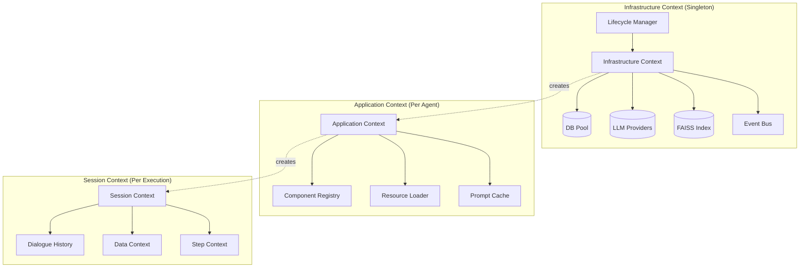
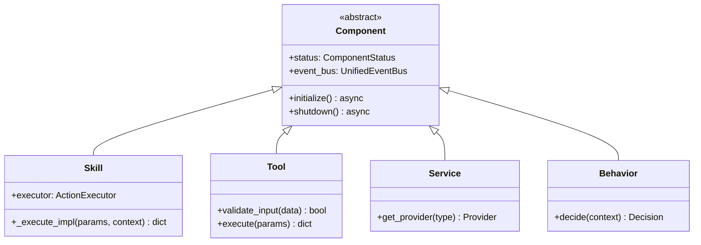
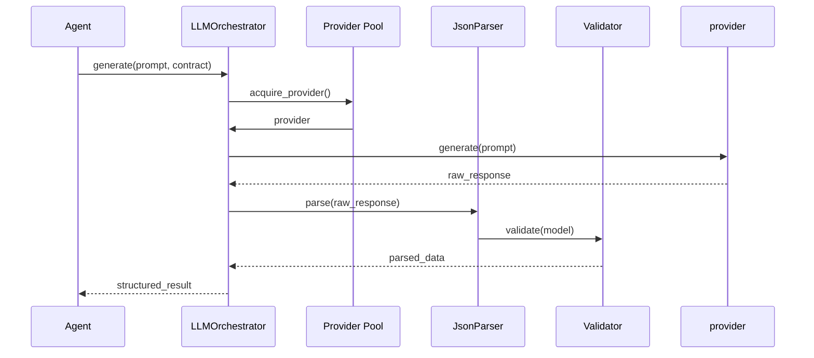
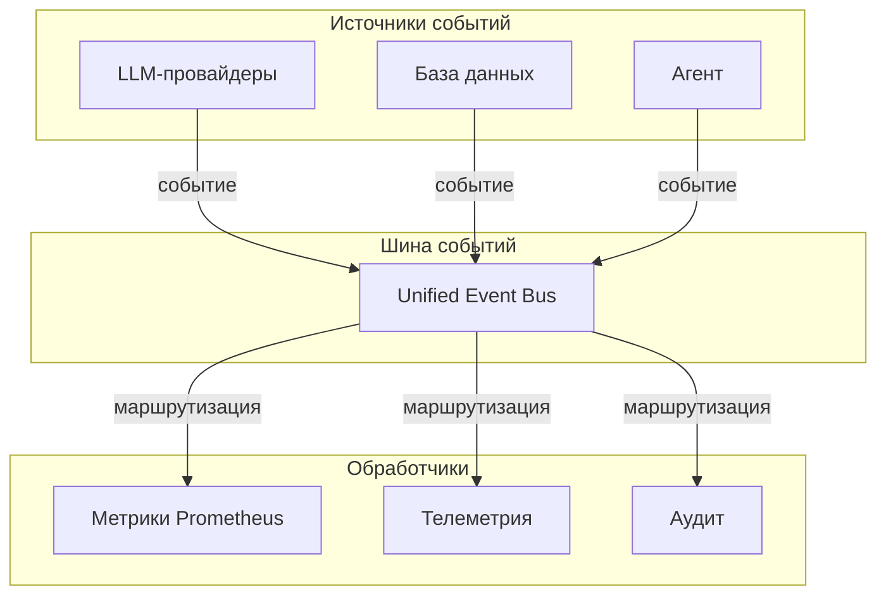

# Koru-Agent (Agent_v5)

---

## 1. Введение. Почему не «ещё один обёрточный фреймворк»?

### Проблема индустрии

Современные LLM-фреймворки (LangChain, AutoGen, CrewAI) проектировались для быстрого прототипирования и исследовательских задач. Однако при попытке перенести их в production возникают системные проблемы:

| Проблема | Описание | Последствия |
|----------|----------|-------------|
| **Глобальное состояние** | AutoGen хранит состояние агентов в памяти процесса | Утечки памяти, невозможность горизонтального масштабирования |
| **Слабая валидация** | JSON-парсинг часто падает, retry на уровне промпта | Непредсказуемое поведение, «почему запрос прошёл, но результат пустой?» |
| **Multi-agent chaos** | Сложность изоляции контекстов между агентами | Перекрёстное засорение состояний, трудноотслеживаемые баги |

### Наша парадигма

Koru-Agent спроектирован под три ключевых принципа:

```
┌─────────────────────────────────────────────────────────────────┐
│                                                                 │
│   DETERMINISM         OBSERVABILITY        PRODUCTION-READY    │
│                                                                 │
│   Контракты first     Полный аудит        Изоляция контекстов   │
│   Валидация на       каждого шага       как архитектурный       │
│   границах                                   аксиом             │
│                                                                 │
└─────────────────────────────────────────────────────────────────┘
```

**Ключевые отличия от мейнстрима:**

1. **Contract-First разработка** — каждый компонент имеет строгие JSON-схемы ввода/вывода в YAML, компилируемые в Pydantic-модели
2. **Строгая изоляция контекстов** — Infrastructure / Application / Session разделены на уровне архитектуры
3. **Наблюдаемость встроена в ядро** — не подключается плагинами, а является частью рантайма
4. **Self-Optimization** — встроенный анализ ошибок и генерация улучшений промптов

---

## 2. Трёхуровневая модель контекстов

### Архитектура



### Уровень 1: InfrastructureContext

**Назначение:** Хранение тяжёлых ресурсов, общих для всего процесса.

**Компоненты:**

| Компонент | Ответственность | Жизненный цикл |
|-----------|------------------|----------------|
| `DBProvider` | Пул соединений к БД | Инициализируется при старте, проверка health-check |
| `LLMProvider` | Абстракция над LlamaCpp/vLLM/OpenRouter | Пересоздание при ошибках, защита от сбоев |
| `FAISSIndex` | Векторный индекс для семантического поиска | Предзагрузка при старте, lazy loading чанков |
| `UnifiedEventBus` | Шина событий с изоляцией сессий | Один экземпляр на процесс |

**LifecycleManager:**

```python
# Пример топологической сортировки зависимостей
class LifecycleManager:
    def _resolve_dependencies(self) -> List[str]:
        graph = {
            "db_provider": [],
            "llm_provider": ["db_provider"],
            "vector_index": ["llm_provider"],
            "event_bus": [],
            "prompt_service": ["llm_provider", "vector_index"],
        }
        return topological_sort(graph)  # db → llm → vector → prompt
```

### Уровень 2: ApplicationContext

**Назначение:** Легковесный контекст на сессию агента. Не держит сетевые соединения.

**Компоненты:**

| Компонент | Ответственность |
|-----------|------------------|
| `ComponentRegistry` | Регистрация и резолвинг компонентов (Skills, Tools, Services) |
| `ResourceLoader` | Загрузка промптов/контрактов из `data/prompts/`, `data/contracts/` |
| `PromptCache` | Предзагруженные промпты (0 FS-вызовов во время выполнения) |

**Ключевое ограничение:** ApplicationContext не имеет доступа к сетевым соединениям. Только метаданные и конфигурация.

### Уровень 3: SessionContext

**Назначение:** Эфемерный контекст на одно выполнение.

| Компонент | Назначение |
|-----------|------------|
| `DialogueHistory` | История диалога с лимитом токенов (авто-truncation при превышении) |
| `DataContext` | Сырые данные шагов (append-only, неизменяемый) |
| `StepContext` | Метаданные выполнения (статусы, ошибки, метрики) |

**Гарантия изоляции:** При падении агента сессия разрушается полностью. Провайдеры инфраструктуры не затрагиваются.

---

## 3. Модель компонентов и Принцип строгой изоляции

### Иерархия компонентов



### ActionExecutor: единственный посредник

**Зачем нужен единый посредник:**

Компоненты системы (навыки, инструменты, сервисы) должны быть **слабо связаны** — это обеспечивает:
- **Заменяемость** — компонент можно обновить или заменить без влияния на другие
- **Тестируемость** — каждый компонент тестируется изолированно
- **Предсказуемость** — все вызовы проходят через единую точку входа с логированием и валидацией
- **Безопасность** — гарантируется, что компоненты не обращаются к инфраструктуре напрямую

ActionExecutor решает эти задачи: резолвит компоненты, проверяет контракты, собирает метрики и гарантирует изоляцию.

**Запрещено:**

- Прямые импорты между навыками (`from skills.planning import ...`)
- Использование `globals()`, `locals()` для межкомпонентного взаимодействия
- Возврат `ExecutionResult` из `_execute_impl` (должен возвращать `dict`)

**Резолвинг через executor:**

```python
# ✅ CORRECT: Через ActionExecutor
result = await self.executor.execute_action(
    action_name="sql_tool.execute",
    parameters={"query": "SELECT * FROM audits"},
    context=execution_context
)

# ❌ FORBIDDEN: Прямой доступ
sql_tool = self.app_ctx.components.get("sql_tool")
result = await sql_tool.execute(query="...")
```

### Статический анализ

Архитектурные нарушения отлавливаются при commit:

```bash
$ python scripts/validation/check_skill_architecture.py

[ERROR] skill_planning.py:42 — Прямой импорт sql_tool
[ERROR] tool_vector.py:15 — Возврат ExecutionResult из _execute_impl
[WARN] service_metrics.py:8 — Использование random без seed
```

---

## 4. Contract-First и Управление ресурсами

### YAML-контракты (реальные примеры из проекта)

**Input: sql_tool.execute_query**
```yaml
# data/contracts/tool/sql_tool/sql_tool.execute_query_input_v1.0.0.yaml
capability: sql_tool.execute_query
version: v1.0.0
status: active
component_type: tool
direction: input
description: Входной контракт для выполнения SQL-запросов
schema_data:
  type: object
  properties:
    sql:
      type: string
      description: SQL-запрос для выполнения
    parameters:
      type: object
      description: Параметры запроса
      additionalProperties: true
    max_rows:
      type: integer
      description: Максимальное количество возвращаемых строк
      default: 1000
  required:
    - sql
```

**Output: sql_tool.execute_query**
```yaml
# data/contracts/tool/sql_tool/sql_tool.execute_query_output_v1.0.0.yaml
capability: sql_tool.execute_query
version: v1.0.0
status: active
component_type: tool
direction: output
description: Выходной контракт для выполнения SQL-запросов
schema_data:
  type: object
  properties:
    rows:
      type: array
      description: Строки результата запроса
      items:
        type: object
    columns:
      type: array
      description: Имена колонок
      items:
        type: string
    rowcount:
      type: integer
      description: Количество возвращённых строк
    execution_time:
      type: number
      description: Время выполнения запроса в секундах
    error:
      type: string
      description: Сообщение об ошибке
      nullable: true
  required:
    - rows
    - columns
    - rowcount
```

### ResourceLoader: автоматическое сканирование

```python
class ResourceLoader:
    def __init__(self, base_path: Path):
        self._cache: Dict[str, Any] = {}
        self._scan_and_validate(base_path)

    def _scan_and_validate(self, base_path: Path):
        for yaml_file in base_path.rglob("*.yaml"):
            capability = yaml_file.parent.name
            version = yaml_file.stem
            schema = self._compile_pydantic(yaml_file)
            self._cache[f"{capability}:{version}"] = schema
```

### Pydantic-компиляция

Схемы YAML конвертируются в Pydantic-модели на лету:

```python
# Автоматическая компиляция
class ContractCompiler:
    def compile(self, yaml_path: Path) -> Type[BaseModel]:
        schema = yaml.safe_load(yaml_path.read_text())
        model = self._yaml_to_pydantic(schema)
        return model

    def _yaml_to_pydantic(self, schema: dict) -> Type[BaseModel]:
        # Поддержка: object, enum, nullable, regex, multipleOf
        fields = {}
        for name, spec in schema.get("properties", {}).items():
            field = self._spec_to_field(spec)
            fields[name] = field
        return create_model("Contract", **fields)
```

### Версионирование

| Статус | Описание | Доступно в prod |
|--------|-----------|-----------------|
| `draft` | Черновик, активная разработка | ❌ |
| `active` | Активная версия в production | ✅ |
| `archived` | Архивная версия | ❌ |

Профиль `prod` разрешает только `active`:

```python
def _validate_status_by_profile(self, config: ComponentConfig):
    allowed = {"active"} if self.profile == "prod" else {"draft", "active", "archived"}
    if config.status not in allowed:
        raise ProductionStatusViolation(
            f"Компонент {config.name} имеет статус {config.status}, "
            f"доступные в prod: active"
        )
```

---

## 5. Оркестрация LLM и Гарантии структурированного вывода

### LLMOrchestrator



### Конфигурация таймаутов

```python
# core/config/llm_config.py
class LLMConfig:
    timeout_seconds: int = 60
    max_retries: int = 3
    backoff_factor: float = 2.0

    retry_codes: set = {429, 500, 502, 503, 504}
```

### Трёхступенчатый парсинг JSON

```python
class JsonParsingService:
    async def parse(self, raw: str, schema: Type[BaseModel]) -> Any:
        # Этап 1: Извлечение из markdown
        extracted = self._extract_json_from_markdown(raw)

        # Этап 2: Исправление ошибок
        fixed = self._fix_json_errors(extracted)  # пропущенные запятые, скобки

        # Этап 3: Валидация против схемы
        validated = schema(**fixed)
        return validated
```

### Абстракция провайдеров

```python
class LLMProvider(ABC):
    @abstractmethod
    async def generate(self, prompt: str, **kwargs) -> str:
        pass

class LlamaCppProvider(LLMProvider):
    def __init__(self, model_path: str, n_gpu_layers: int = 0):
        ...

class VLLMProvider(LLMProvider):
    def __init__(self, endpoint: str, api_key: str):
        ...

class OpenRouterProvider(LLMProvider):
    def __init__(self, api_key: str, model: str):
        ...
```

---

## 6. Логирование и Шина событий

### Логирование: стандартный `logging`

Основные логи пишутся через стандартный модуль `logging` с привязкой к сессии:

```
2026-04-20 14:56:46,115 | INFO     | AGENT_START          | agent.agent_001                | Агент agent_001 запущен, цель: Сколько проверок было проведено в 2024?...
2026-04-20 14:56:46,118 | INFO     | STEP_STARTED         | agent.agent_001                | 📍 ШАГ 1/10
```

### Шина событий: метрики и телеметрия



**Ключевые свойства:**

| Свойство | Описание |
|----------|----------|
| **Изоляция сессий** | События сессии A физически не попадают в обработку сессии B |
| **Маршрутизация по доменам** | Фильтрация: `agent`, `infrastructure`, `optimization` |
| **Exactly-Once** | Гарантированное отсутствие дублирования |
| **Управление потоком** | Ограничение размера очереди (по умолчанию 1000 событий) |

### Структура файлов логов (реальная)

```
logs/2026-04-20_14-56-25/
├── infra_context.log    # Инфраструктура (провайдеры, БД, LLM)
├── app_context.log   # Приложение (компоненты)
├── llm_calls.log   # Все LLM-вызовы с промптами
└── agents/
    └── 2026-04-20_14-56-46.log  # Сессия агента
```

### Фильтрация в терминале

```python
# Конфигурация: какие события показывать в терминале
class LoggingConfig:
    console_allowed_events: set = {
        LogEventType.USER_PROGRESS,
        LogEventType.USER_RESULT,
        LogEventType.AGENT_START,
        LogEventType.AGENT_STOP,
    }
```

**Правило:** События без `event_type` попадают только в файлы, а не в терминал.

---

## 7. Безопасность и Валидация на уровне исполнения

### SQLValidator

```python
# Реальная реализация: использует sqlparse + регулярные выражения

class SQLValidatorService(Service):
    def __init__(self, allowed_operations: List[str] = None):
        self.allowed_operations = set(allowed_operations or ["SELECT"])
        # Регулярные выражения для обнаружения угроз
        self._dangerous_patterns = [
            r"(?i)(drop|delete|insert|update|truncate|alter|create)",
            r"(?i)(union\s+select|waitfor\s+delay|benchmark\()",
        ]

    async def validate_query(self, sql_query: str, parameters: Dict = None):
        validation_errors = []

        # 1. Парсинг через sqlparse
        parsed = sqlparse.parse(sql_query)

        # 2. Проверка разрешённых операций (белый список)
        forbidden = ["DELETE", "DROP", "ALTER", "TRUNCATE", "INSERT", "UPDATE"]
        for op in forbidden:
            if re.search(rf'\b{op}\b', sql_query.upper()):
                validation_errors.append(f"Запрещённая операция: {op}")

        # 3. Запрет конкатенации (защита от инъекций)
        if re.search(r'\|\||\+|CONCAT\(', sql_query, re.I):
            validation_errors.append("Запрещена конкатенация в SQL")

        # 4. Валидация имён таблиц/колонок
        # 5. Проверка параметров

        return ValidatedSQL(
            is_valid=len(validation_errors) == 0,
            validation_errors=validation_errors,
            safety_score=self._calculate_safety_score(sql_query)
        )
```

### ParamValidator: трёхступенчатая валидация

```python
class ParamValidator:
    async def validate(self, param: str, param_schema: ParamSchema) -> Any:
        # Этап 1: Проверка по enum (мгновенно)
        if param_schema.enum and param in param_schema.enum:
            return param

        # Этап 2: SQL ILIKE поиск по БД
        suggestions = await self._db_lookup(param, param_schema)
        if suggestions:
            return self._match_exact(param, suggestions) or suggestions[0]

        # Этап 3: Vector/Fuzzy matching для опечаток
        fuzzy_matches = await self._fuzzy_lookup(param, param_schema)
        if fuzzy_matches:
            return fuzzy_matches[0]

        raise ParamValidationError(f"Параметр '{param}' не найден")
```

---

## 8. Сравнение с готовыми решениями

| Критерий | LangChain / CrewAI / AutoGen | Koru-Agent (Agent_v5) |
|----------|------------------------------|------------------------|
| **Архитектура** | Линейные цепочки / графы. Глобальное состояние. | 3-уровневые контексты. Строгая изоляция. DI. |
| **Валидация** | JSON-парсинг часто падает. Retry на уровне промпта. | Contract-First. Pydantic-валидация. 3-ступенчатый парсер. |
| **Наблюдаемость** | Логирование разрозненное. Сложно отследить сессию. | Session-based логирование (logging), Event Bus для метрик. |
| **Оптимизация** | Вручную или через внешние пайплайны. | Планируется: Self-Improvement цикл |
| **Безопасность** | Доверяем LLM. SQL-инъекции возможны. | SQLValidator, ParamValidator, статический аудит кода. |
| **Context isolation** | Глобальные состояния агентов в памяти процесса | Infrastructure / Application / Session полностью изолированы |
| **Цель** | Быстрый прототип, research. | Production-ready, аудит, долгосрочная поддержка. |

### Пример: 3-ступенчатый JSON-парсинг

Реальный ответ от LLM (из логов):
```
[raw_response]:
{
  "analysis_question_decomposition": "Вопрос не содержит подвопросов.",
  "analysis_subquestions_tracking": "[]",
  "analysis_progress": "0/0 подвопросов решены",
  "analysis_deficit": "Нет данных для анализа",
  "stop_condition": false,
  "decision": {
    "next_action": "check_result.generate_script",
    "parameters": {"query": "Сколько проверок было проведено в 2024?"}
  }
}
```

Этапы обработки:
1. **Из markdown** — извлечение JSON из ````json ... ````
2. **Исправление** — автоматическое исправление синтаксиса (пропущенные запятые, скобки)
3. **Валидация** — проверка against Pydantic-схемы контракта

---

## 9. Заключение и Технические перспективы

### Текущее состояние

| Компонент | Статус | Описание |
|-----------|--------|----------|
| Ядро (3 уровня контекстов) | ✅ Готово | Infrastructure / Application / Session |
| Contract-First | ✅ Готово | YAML-контракты, Pydantic-компиляция |
| ActionExecutor | ✅ Готово | DI, статический анализ |
| LLMOrchestrator | ✅ Готово | Провайдеры, 3-ступенчатый парсинг |
| Event Bus | ✅ Готово | Изоляция сессий, маршрутизация по доменам |
| SQLValidator | ✅ Готово | SELECT-only, sqlparse + regex |
| UI (Streamlit) | ✅ Готово | Интерактивный интерфейс |
| Observability | ✅ Готово | Session-based JSONL, Prometheus |

### Ближайшие шаги

#### 1. RBAC (Role-Based Access Control)

**Что это:** Система разграничения прав доступа на уровне агентов и компонентов.

**Зачем нужно:**
- Изоляция агентов по проектам/клиентам
- Аудит действий пользователей в enterprise-окружении
- Предотвращение несанкционированного доступа к данным

**План реализации:**
- Таблица ролей: `GUEST` (только чтение), `USER` (SELECT-запросы), `ADMIN` (полный доступ)
- Интеграция с `SecurityManager`
- Логирование всех действий с привязкой к user_id

#### 2. Self-Improvement (Встроенный цикл оптимизации)

**Что это:** Автоматический анализ ошибок агента и генерация улучшений промптов.

**Зачем нужно:**
- Уменьшение ручной работы по поддержке промптов
- Быстрое обнаружение и исправление паттернов ошибок
- Детерминированное A/B тестирование перед продвижением версий

**План реализации:**
- `ExecutionTrace` — сбор данных о выполнении (входы, результаты, ошибки)
- `PatternAnalyzer` — поиск повторяющихся паттернов ошибок
- `PromptGenerator` — генерация улучшенных версий промптов через LLM
- `ABTester` — статистически значимое сравнение версий
- `SafetyLayer` — проверка метрик (success_rate, latency) перед промоушеном

#### 3. Расширение навыков (Skill Expansion)

**Что это:** Добавление новых компонентов в систему.

**Зачем нужно:**
- Покрытие новых бизнес-задач в рамках disrupt
- Интеграция с внешними сервисами

#### 4. Горячая перезагрузка

**Что это:** Обновление компонентов без рестарта контекста.

**Зачем нужно:**
- Zero-downtime обновления промптов и контрактов
- Быстрое применение исправлений в production

#### 5. Внешние провайдеры

**Что это:** Расширение списка поддерживаемых LLM.

**Зачем нужно:**
- Гибкость в выборе модели под задачу
- Cost optimization (дешёвые модели для простых задач)

### Итог

> **Koru-Agent — это не «обёртка над LLM». Это операционная система для агентных задач с гарантиями:**
>
> - **Валидации** — Contract-First, Pydantic, статический аудит
> - **Изоляции** — Три уровня контекстов, никаких глобальных состояний
> - **Наблюдаемости** — Session-based логирование (logging), Event Bus для метрик
> - **Безопасности** — SQLValidator, ParamValidator, RBAC (в планах)
> - **Самооптимизации** — Self-Improvement цикл (в планах)

Система готова к масштабированию и интеграции в enterprise-инфраструктуру.

---

## Приложение A: Примеры YAML-контрактов (из проекта)

**Input: behavior.react.think** (рассуждение в цикле ReAct)
```yaml
# data/contracts/behavior/behavior.react.think_input_v1.0.0.yaml
capability: behavior.react.think
component_type: behavior
description: Input contract for behavior.react.think - рассуждение в цикле ReAct
direction: input
schema_data:
  type: object
  properties:
    input:
      type: string
      description: Текущий контекст задачи и состояние
    goal:
      type: string
      description: Исходная цель задачи
    step_history:
      type: string
      description: История выполненных шагов с результатами
    observation:
      type: string
      description: Результат последнего наблюдения
    available_tools:
      type: string
      description: Список доступных инструментов с описаниями
  required:
    - input
    - goal
  additionalProperties: true
status: active
version: v1.0.0
```

## Приложение B: Пример лога сессии (реальный)

```
2026-04-20 14:56:46,115 | INFO     | AGENT_START          | agent.agent_001                | Агент agent_001 запущен, цель: Сколько проверок было проведено в 2024?...
2026-04-20 14:56:46,118 | INFO     | SYSTEM_INIT          | agent.agent_001                | 📦 Доступно capability: 4
2026-04-20 14:56:46,118 | INFO     | STEP_STARTED         | agent.agent_001                | 📍 ШАГ 1/10
2026-04-20 15:00:51,364 | INFO     | AGENT_DECISION       | agent.agent_001                | ✅ Pattern вернул: type=act, action=check_result.generate_script
Дефицит: Нет данных для анализа
Выбор инструмента: check_result.generate_script
Остановка: нет
Итог: Выполнить SQL-запрос для подсчёта проверок в 2024
2026-04-20 15:00:51,365 | INFO     | TOOL_CALL            | agent.agent_001                | ⚙️ Запускаю check_result.generate_script с параметрами: {'query': 'Сколько проверок было проведено в 2024?', 'max_results': 1}
2026-04-20 15:19:02,262 | INFO     | TOOL_RESULT          | agent.agent_001                | ✅ Действие check_result.generate_script выполнено
2026-04-20 15:19:02,267 | DEBUG    | STEP_COMPLETED       | agent.agent_001                | 📝 Сохранено observation: item_id=auto_1, items: 2→3
2026-04-20 15:19:02,269 | INFO     | INFO                 | agent.agent_001                | 👁️ Observer.analyze(check_result.generate_script)...
2026-04-20 15:19:02,408 | INFO     | INFO                 | agent.agent_001                | 📊 Observation: status=partial, quality={'completeness': 0.5, 'reliability': 0.5}
2026-04-20 15:19:02,412 | INFO     | STEP_STARTED         | agent.agent_001                | 📍 ШАГ 2/10
2026-04-20 15:29:27,771 | INFO     | AGENT_DECISION       | agent.agent_001                | ✅ Pattern вернул: type=act, action=final_answer.generate
2026-04-20 15:36:03,538 | INFO     | TOOL_RESULT          | agent.agent_001                | ✅ final_answer.generate → completed
```

**Ключевые метрики сессии:**

| Метрика | Значение |
|---------|----------|
| Длительность | ~40 мин |
| Шагов | 2/10 |
| LLM-вызовов | 1 |
| Результат | partial (качество 0.5) |
