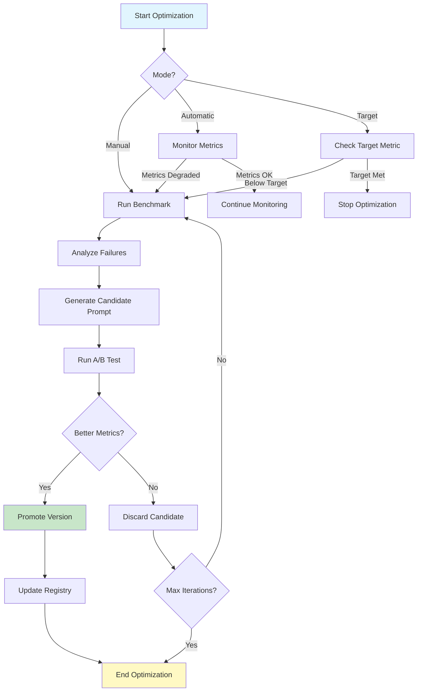

# 📋 План внедрения системы Benchmark + Learning для Agent_v5

> **Версия:** 1.0.0  
> **Дата создания:** 2026-02-17  
> **Статус:** approved  
> **Владелец:** @system

---

## 📋 Оглавление

- [Обзор](#-обзор)
- [Текущая архитектура](#-текущая-архитектура)
- [Новые компоненты](#-новые-компоненты)
- [Размещение компонентов](#-размещение-компонентов)
- [Сбор метрик](#-сбор-метрик)
- [Сбор логов](#-сбор-логов)
- [Цикл обучения](#-цикл-обучения)
- [План внедрения](#-план-внедрения)
- [Интеграция с существующими компонентами](#-интеграция-с-существующими-компонентами)
- [Тестирование](#-тестирование)
- [Риски и митигация](#-риски-и-митигация)

---

## 🔍 Обзор

Этот документ описывает план внедрения системы **Benchmark + Learning** в архитектуру Agent_v5. Система позволит:

- ✅ Автоматически оценивать качество работы агента через бенчмарки
- ✅ Собирать метрики выполнения через EventBus
- ✅ Автоматически оптимизировать промпты и контракты
- ✅ Проводить A/B тестирование версий компонентов
- ✅ Стремиться к целевым метрикам через циклы обучения

### Ключевые принципы

| Принцип | Описание |
|---------|----------|
| **Infrastructure = сбор** | MetricsCollector и LogCollector в Infrastructure для централизованного сбора |
| **Application = анализ** | LearningOrchestrator и BenchmarkService в Application для анализа и оптимизации |
| **EventBus = транспорт** | Все метрики и логи передаются через EventBus |
| **Изоляция** | Каждый агент имеет изолированные метрики в sandbox режиме |

---

## 🏗️ Текущая архитектура

### Существующие компоненты

```
project/
├── core/
│   ├── infrastructure/
│   │   ├── context/
│   │   │   └── infrastructure_context.py      # Инфраструктурный контекст
│   │   ├── event_bus/
│   │   │   ├── event_bus.py                   # Шина событий ✅
│   │   │   └── event_handlers.py              # Обработчики событий ✅
│   │   └── storage/
│   │       ├── prompt_storage.py              # Хранилище промптов
│   │       └── contract_storage.py            # Хранилище контрактов
│   │
│   └── application/
│       ├── context/
│       │   └── application_context.py         # Прикладной контекст ✅
│       ├── services/
│       │   ├── prompt_service.py              # Сервис промптов
│       │   └── contract_service.py            # Сервис контрактов
│       └── behaviors/
│           └── base_behavior.py               # Базовый паттерн поведения
│
└── data/
    ├── prompts/                               # Промпты
    ├── contracts/                             # Контракты
    └── registry.yaml                          # Реестр версий ✅
```

### Проблемные зоны для Benchmark/Learning

| Проблема | Влияние | Приоритет |
|----------|---------|-----------|
| Нет системы сбора метрик | Невозможно оценивать качество | 🔴 Критический |
| Нет хранилища результатов бенчмарков | Нельзя сравнивать версии | 🔴 Критический |
| Нет цикла оптимизации | Ручная доработка промптов | 🟠 Важный |
| Нет A/B тестирования | Нельзя безопасно тестировать изменения | 🟠 Важный |
| EventBus не используется для метрик | Метрики теряются | 🟡 Желательный |

---

## 🆕 Новые компоненты

### 1. MetricsCollector (Infrastructure)

**Назначение:** Централизованный сбор метрик со всех агентов

```python
# core/infrastructure/metrics/metrics_collector.py

class MetricsCollector:
    """
    Сбор метрик через EventBus.
    
    ИНТЕГРАЦИЯ:
    - Подписывается на события выполнения
    - Извлекает метрики из event.data
    - Агрегирует и сохраняет в хранилище
    """
    
    DEPENDENCIES = ['event_bus', 'metrics_storage']
    
    async def initialize(self):
        # Подписка на события
        self.event_bus.subscribe(EventType.SKILL_EXECUTED, self._on_skill_executed)
        self.event_bus.subscribe(EventType.CAPABILITY_SELECTED, self._on_capability_selected)
        self.event_bus.subscribe(EventType.ERROR_OCCURRED, self._on_error)
    
    async def _on_skill_executed(self, event: Event):
        """Извлечение метрик из события выполнения навыка"""
        metric_data = {
            'agent_id': event.data.get('agent_id'),
            'capability': event.data.get('capability'),
            'execution_time_ms': event.data.get('execution_time_ms'),
            'success': event.data.get('success'),
            'tokens_used': event.data.get('tokens_used'),
            'timestamp': event.timestamp.isoformat()
        }
        
        await self.metrics_storage.record(metric_data)
    
    async def get_aggregated_metrics(
        self,
        capability: str,
        version: str,
        time_range: Tuple[datetime, datetime]
    ) -> AggregatedMetrics:
        """Агрегация метрик для бенчмарка"""
        pass
```

### 2. LogCollector (Infrastructure)

**Назначение:** Централизованный сбор структурированных логов

```python
# core/infrastructure/logging/log_collector.py

class LogCollector:
    """
    Централизованный сбор логов для обучения.
    
    ОТЛИЧИЯ ОТ ОБЫЧНОГО ЛОГИРОВАНИЯ:
    - Структурированные логи (JSON)
    - Корреляция по agent_id, session_id, capability
    - Сохранение в хранилище для анализа
    - Фильтрация по уровню важности для обучения
    """
    
    DEPENDENCIES = ['event_bus', 'log_storage']
    
    async def initialize(self):
        # Подписка на события с деталями выполнения
        self.event_bus.subscribe(EventType.CAPABILITY_SELECTED, self._on_capability_selected)
        self.event_bus.subscribe(EventType.ERROR_OCCURRED, self._on_error)
        self.event_bus.subscribe(EventType.BENCHMARK_STARTED, self._on_benchmark_start)
    
    async def _on_capability_selected(self, event: Event):
        """Логирование выбора capability для анализа решений агента"""
        log_entry = {
            'timestamp': event.timestamp.isoformat(),
            'agent_id': event.data.get('agent_id'),
            'session_id': event.data.get('session_id'),
            'capability': event.data.get('capability'),
            'parameters': event.data.get('parameters'),
            'reasoning': event.data.get('reasoning'),  # ← Важно для обучения!
            'pattern_id': event.data.get('pattern_id'),
            'correlation_id': event.correlation_id
        }
        
        await self.log_storage.save('capability_selection', log_entry)
    
    async def get_session_logs(
        self,
        agent_id: str,
        session_id: str,
        limit: int = 1000
    ) -> List[Dict]:
        """Получение логов сессии для анализа"""
        pass
```

### 3. BenchmarkService (Application)

**Назначение:** Оркестрация бенчмарков для оценки качества агента

```python
# core/application/services/benchmark_service.py

class BenchmarkService(BaseService):
    """
    Оркестрация бенчмарков для оценки качества агента.
    
    ФУНКЦИИ:
    - Запуск бенчмарков по сценариям
    - Сбор метрик выполнения
    - Сравнение версий промптов/контрактов
    - Автоматическое продвижение версий при улучшении метрик
    """
    
    DEPENDENCIES = ['metrics_collector', 'prompt_service', 'contract_service']
    
    async def run_benchmark(
        self,
        scenario: BenchmarkScenario,
        agent_config: AgentConfig,
        baseline_version: str = None
    ) -> BenchmarkResult:
        """Запуск бенчмарка по сценарию"""
        pass
    
    async def compare_versions(
        self,
        capability: str,
        version_a: str,
        version_b: str,
        scenarios: List[BenchmarkScenario]
    ) -> VersionComparison:
        """Сравнение двух версий промпта/контракта"""
        pass
    
    async def auto_promote_if_better(
        self,
        capability: str,
        candidate_version: str,
        current_version: str,
        metric_threshold: float
    ) -> bool:
        """Автоматическое продвижение версии если метрики лучше"""
        pass
```

### 4. LearningOrchestrator (Application)

**Назначение:** Оркестратор обучения — создание тестовых контекстов

```python
# core/application/services/learning_orchestrator.py

class LearningOrchestratorService(BaseService):
    """
    Оркестратор обучения — единственный компонент, который может:
    - Создавать тестовые ApplicationContext
    - Запускать агентов с разными версиями промптов
    - Собирать метрики и сравнивать результаты
    """
    
    DEPENDENCIES = ['benchmark_service', 'metrics_collector']
    
    async def create_test_context(
        self,
        base_config: AppConfig,
        prompt_overrides: Dict[str, str],
        profile: str = "sandbox"
    ) -> ApplicationContext:
        """Создаёт изолированный тестовый контекст"""
        
        # 1. Клонируем конфигурацию с новыми версиями
        test_config = await self._clone_config_with_overrides(
            base_config, 
            prompt_overrides
        )
        
        # 2. Создаём НОВЫЙ InfrastructureContext (или используем общий)
        test_infra = await self._create_test_infrastructure()
        
        # 3. Создаём ApplicationContext с тестовой конфигурацией
        test_ctx = ApplicationContext(
            infrastructure_context=test_infra,
            config=test_config,
            profile=profile  # sandbox = разрешены draft версии
        )
        
        await test_ctx.initialize()
        
        return test_ctx
    
    async def run_benchmark_iteration(
        self,
        scenario: BenchmarkScenario,
        candidate_versions: Dict[str, str]
    ) -> BenchmarkResult:
        """Запускает одну итерацию бенчмарка"""
        
        # Создаём тестовый контекст
        test_ctx = await self.create_test_context(
            base_config=self._base_config,
            prompt_overrides=candidate_versions
        )
        
        # Создаём агента для теста
        agent = await self._create_test_agent(test_ctx, scenario.goal)
        
        # Запускаем и собираем метрики
        result = await agent.run(scenario.goal)
        metrics = await self._collect_metrics(test_ctx, result)
        
        # Очищаем ресурсы
        await test_ctx.infrastructure_context.shutdown()
        
        return BenchmarkResult(
            scenario_id=scenario.id,
            versions=candidate_versions,
            metrics=metrics,
            success=result.success
        )
```

### 5. PromptContractGenerator (Application)

**Назначение:** Генерация новых версий промптов и контрактов

```python
# core/application/services/prompt_contract_generator.py

class PromptContractGenerator(BaseService):
    """
    Генерация новых версий промптов и контрактов.
    Имеет доступ на запись в data/ директорию.
    """
    
    DEPENDENCIES = ['llm_provider', 'file_tool']
    
    async def generate_prompt_variant(
        self,
        capability: str,
        base_version: str,
        optimization_goal: str,
        failure_analysis: FailureAnalysis
    ) -> str:
        """Генерирует новую версию промпта"""
        
        # 1. Загружаем текущий промпт
        current_prompt = await self._load_prompt(capability, base_version)
        
        # 2. Анализируем неудачи
        failure_patterns = await self._analyze_failures(failure_analysis)
        
        # 3. Генерируем новый промпт через LLM
        new_content = await self.llm_provider.generate(
            prompt=self._build_generation_prompt(
                current_content=current_prompt.content,
                failure_patterns=failure_patterns,
                optimization_goal=optimization_goal
            )
        )
        
        # 4. Создаём новую версию (draft)
        new_version = self._calculate_next_version(base_version, 'minor')
        
        new_prompt = Prompt(
            capability=capability,
            version=new_version,
            status=PromptStatus.DRAFT,  # ← Важно: только DRAFT
            component_type=current_prompt.component_type,
            content=new_content,
            variables=current_prompt.variables,
            metadata={
                **current_prompt.metadata,
                'generated_from': base_version,
                'optimization_goal': optimization_goal,
                'generated_at': datetime.now().isoformat()
            }
        )
        
        # 5. Сохраняем в файловую систему
        await self._save_prompt(new_prompt)
        
        # 6. Генерируем соответствующий контракт (если нужно)
        await self._generate_matching_contract(new_prompt)
        
        return new_version
```

---

## 📍 Размещение компонентов

### Правильное размещение

```
project/
├── core/
│   ├── infrastructure/
│   │   ├── metrics/                        ← НОВОЕ
│   │   │   ├── metrics_collector.py        # Сбор метрик (Infrastructure)
│   │   │   └── metrics_storage.py          # Хранилище метрик
│   │   │
│   │   ├── logging/                        ← НОВОЕ
│   │   │   ├── log_collector.py            # Сбор логов (Infrastructure)
│   │   │   └── log_storage.py              # Хранилище логов
│   │   │
│   │   └── event_bus/
│   │       └── event_bus.py                # + новые EventType
│   │
│   └── application/
│       ├── services/
│       │   ├── learning_orchestrator.py    # Оркестратор (Application)
│       │   ├── benchmark_service.py        # Бенчмарк (Application)
│       │   ├── optimization_service.py     # Оптимизация (Application)
│       │   └── prompt_contract_generator.py # Генерация промптов
│       │
│       └── behaviors/
│           └── learning_pattern.py         # Паттерн обучения
│
└── data/
    ├── benchmarks/                         # Сценарии бенчмарков
    │   ├── scenarios/
    │   └── datasets/
    └── metrics/                            # История метрик
```

### Почему так?

| Компонент | Слой | Почему |
|-----------|------|--------|
| **MetricsCollector** | Infrastructure | Централизованный сбор со всех агентов |
| **LogCollector** | Infrastructure | Централизованное хранение логов |
| **LearningOrchestrator** | Application | Оркестрация поведения агента |
| **BenchmarkService** | Application | Тестирование application-компонентов |
| **OptimizationService** | Application | Генерация новых промптов/контрактов |

**Главное правило:**
```
Infrastructure = сбор и хранение (централизованно)
Application = анализ и оптимизация (пер-агент)
```

---

## 📊 Сбор метрик

### Через EventBus (рекомендуется)

```python
# core/infrastructure/event_bus/event_bus.py

class EventType(Enum):
    # ... существующие ...
    
    # НОВЫЕ для benchmark/learning:
    METRIC_RECORDED = "metric.recorded"
    BENCHMARK_STARTED = "benchmark.started"
    BENCHMARK_COMPLETED = "benchmark.completed"
    OPTIMIZATION_CYCLE_STARTED = "optimization.cycle_started"
    OPTIMIZATION_CYCLE_COMPLETED = "optimization.cycle_completed"
    VERSION_PROMOTED = "version.promoted"
    VERSION_REJECTED = "version.rejected"
```

### Инструментирование компонентов

```python
# core/application/skills/base_skill.py

class BaseSkill(BaseComponent):
    async def execute(self, capability, parameters, context):
        start_time = time.time()
        success = False
        
        try:
            # ← Существующая логика
            result = await self._execute_impl(capability, parameters, context)
            success = True
            return result
            
        finally:
            # ← Публикация метрик (всегда, даже при ошибке)
            await self._publish_metrics(
                capability=capability.name,
                execution_time_ms=(time.time() - start_time) * 1000,
                success=success,
                context=context
            )
    
    async def _publish_metrics(self, capability, execution_time_ms, success, context):
        """Публикация метрик в EventBus"""
        await self.application_context.infrastructure_context.event_bus.publish(
            EventType.SKILL_EXECUTED,
            data={
                'agent_id': self.application_context.id,
                'capability': capability,
                'execution_time_ms': execution_time_ms,
                'success': success,
                'session_id': getattr(context, 'session_id', None),
                'step_number': getattr(context, 'current_step', None)
            },
            source=self.name
        )
```

### Типы метрик

| Метрика | Тип | Описание |
|---------|-----|----------|
| `accuracy` | gauge | Точность ответов |
| `latency` | histogram | Время выполнения |
| `token_usage` | counter | Использование токенов |
| `success_rate` | gauge | Процент успешных выполнений |
| `cost` | counter | Стоимость выполнения |
| `error_rate` | gauge | Процент ошибок |

---

## 📝 Сбор логов

### Централизованный LogCollector

```python
# core/infrastructure/logging/log_collector.py

class LogCollector:
    async def _on_capability_selected(self, event: Event):
        """Логирование выбора capability для анализа решений агента"""
        log_entry = {
            'timestamp': event.timestamp.isoformat(),
            'agent_id': event.data.get('agent_id'),
            'session_id': event.data.get('session_id'),
            'capability': event.data.get('capability'),
            'parameters': event.data.get('parameters'),
            'reasoning': event.data.get('reasoning'),  # ← Важно для обучения!
            'pattern_id': event.data.get('pattern_id'),
            'correlation_id': event.correlation_id
        }
        
        await self.log_storage.save('capability_selection', log_entry)
    
    async def _on_error(self, event: Event):
        """Логирование ошибок для анализа неудач"""
        log_entry = {
            'timestamp': event.timestamp.isoformat(),
            'agent_id': event.data.get('agent_id'),
            'session_id': event.data.get('session_id'),
            'capability': event.data.get('capability'),
            'error_type': event.data.get('error_type'),
            'error_message': event.data.get('error_message'),
            'stack_trace': event.data.get('stack_trace'),
            'step_number': event.data.get('step_number'),
            'context_snapshot': event.data.get('context_snapshot')
        }
        
        await self.log_storage.save('errors', log_entry)
```

### Контекст выполнения для обучения

```python
# core/models/data/learning.py

@dataclass
class ExecutionContextSnapshot:
    """
    Снимок контекста выполнения для анализа.
    
    СОХРАНЯЕТСЯ В ЛОГИ ДЛЯ ОБУЧЕНИЯ:
    - Какие capability были доступны
    - Какой паттерн поведения использовался
    - Какие решения принимал агент
    - Какие ошибки возникали
    """
    
    agent_id: str
    session_id: str
    step_number: int
    timestamp: datetime
    
    # Контекст решения
    available_capabilities: List[str]
    selected_capability: str
    behavior_pattern: str
    reasoning: str
    
    # Параметры выполнения
    input_parameters: Dict[str, Any]
    output_result: Optional[Dict[str, Any]]
    
    # Метрики
    execution_time_ms: float
    tokens_used: int
    success: bool
    
    # Ошибки
    error_type: Optional[str]
    error_message: Optional[str]
    
    # Версии ресурсов
    prompt_version: str
    contract_version: str
```

---

## 🔄 Цикл обучения

### Архитектурный поток



### Режимы обучения

| Режим | Описание | Когда использовать |
|-------|----------|-------------------|
| **Manual** | Ручная оптимизация по запросу | Для точечных улучшений |
| **Automatic** | Автоматический цикл при ухудшении метрик | Для поддержания качества |
| **Target** | Стремление к целевой метрике | Для достижения KPI |

### Пример использования

```python
# scripts/run_optimization.py

async def main():
    # 1. Инициализация
    infra = await InfrastructureContext.create(config)
    app_ctx = await ApplicationContext.create_from_registry(infra, profile="prod")
    
    # 2. Получение сервисов обучения
    optimization_service = app_ctx.get_service("optimization_service")
    
    # 3. Запуск цикла оптимизации
    result = await optimization_service.start_optimization_cycle(
        capability="planning.create_plan",
        mode=OptimizationMode.TARGET,
        target_metric=TargetMetric(
            name="accuracy",
            target_value=0.95,
            current_value=0.87
        ),
        max_iterations=20
    )
    
    # 4. Отчёт
    print(f"Оптимизация завершена: {result.status}")
    print(f"Лучшая версия: {result.best_version}")
    print(f"Финальная точность: {result.final_metrics.accuracy}")
```

---

## 📅 План внедрения

### Этап 1: Фундамент (1-2 недели)

| Задача | Файлы | Приоритет | Статус |
|--------|-------|-----------|--------|
| Создать модели метрик | `core/models/data/metrics.py` | 🔴 | ⬜ |
| Создать модели бенчмарков | `core/models/data/benchmark.py` | 🔴 | ⬜ |
| Расширить EventBus | `core/infrastructure/event_bus/event_bus.py` | 🔴 | ⬜ |
| Создать BenchmarkStorage | `core/infrastructure/storage/benchmark_storage.py` | 🔴 | ⬜ |

### Этап 2: Сервисы (2-3 недели)

| Задача | Файлы | Приоритет | Статус |
|--------|-------|-----------|--------|
| MetricsCollector Service | `core/infrastructure/metrics/metrics_collector.py` | 🔴 | ⬜ |
| LogCollector Service | `core/infrastructure/logging/log_collector.py` | 🔴 | ⬜ |
| BenchmarkService | `core/application/services/benchmark_service.py` | 🔴 | ⬜ |
| Интеграция с EventBus | Все сервисы | 🟠 | ⬜ |

### Этап 3: Оптимизация (2-3 недели)

| Задача | Файлы | Приоритет | Статус |
|--------|-------|-----------|--------|
| LearningOrchestrator | `core/application/services/learning_orchestrator.py` | 🟠 | ⬜ |
| OptimizationService | `core/application/services/optimization_service.py` | 🟠 | ⬜ |
| PromptContractGenerator | `core/application/services/prompt_contract_generator.py` | 🟠 | ⬜ |
| A/B тестирование версий | `core/application/data_repository.py` | 🟠 | ⬜ |

### Этап 4: Интеграция (1-2 недели)

| Задача | Файлы | Приоритет | Статус |
|--------|-------|-----------|--------|
| Расширить ApplicationContext | `core/application/context/application_context.py` | 🟡 | ⬜ |
| Расширить Manifest | Все манифесты | 🟡 | ⬜ |
| Скрипты запуска | `scripts/run_benchmark.py` | 🟡 | ⬜ |
| Документация | `docs/learning_system.md` | 🟡 | ⬜ |

---

## 🔗 Интеграция с существующими компонентами

### EventBus (Расширить)

```python
# core/infrastructure/event_bus/event_bus.py

class EventType(Enum):
    # Существующие события
    SYSTEM_INITIALIZED = "system.initialized"
    AGENT_CREATED = "agent.created"
    SKILL_EXECUTED = "skill.executed"
    
    # ← НОВЫЕ для benchmark/learning:
    METRIC_RECORDED = "metric.recorded"
    BENCHMARK_STARTED = "benchmark.started"
    BENCHMARK_COMPLETED = "benchmark.completed"
    OPTIMIZATION_CYCLE_STARTED = "optimization.cycle_started"
    OPTIMIZATION_CYCLE_COMPLETED = "optimization.cycle_completed"
    VERSION_PROMOTED = "version.promoted"
    VERSION_REJECTED = "version.rejected"
```

### ApplicationContext (Доработать)

```python
# core/application/context/application_context.py

class ApplicationContext(BaseSystemContext):
    def __init__(
        self,
        infrastructure_context: InfrastructureContext,
        config: AppConfig,
        profile: Literal["prod", "sandbox"] = "prod",
        mode: AgentMode = AgentMode.PRODUCTION  # ← НОВОЕ
    ):
        self.mode = mode  # PRODUCTION | BENCHMARK | LEARNING
        
    async def initialize(self):
        # В режиме LEARNING подключать LearningPattern
        if self.mode == AgentMode.LEARNING:
            await self._initialize_learning_components()
```

### DataRepository (Расширить)

```python
# core/application/data_repository.py

class DataRepository:
    async def get_prompt_versions(self, capability: str) -> List[PromptVersion]:
        """Получить все версии промпта для capability"""
        pass
    
    async def compare_prompts(
        self,
        capability: str,
        version_a: str,
        version_b: str
    ) -> PromptComparison:
        """Сравнить две версии промпта"""
        pass
    
    async def promote_version(
        self,
        capability: str,
        from_version: str,
        to_version: str
    ) -> bool:
        """Продвинуть версию в active статус"""
        pass
```

### Manifest (Добавить метрики)

```yaml
# data/manifests/skills/planning/manifest.yaml

component_id: planning
component_type: skill
version: v1.0.0
status: active

# ← ДОБАВИТЬ секцию метрик:
performance_metrics:
  accuracy_target: 0.95
  latency_target_ms: 1000
  success_rate_target: 0.98
  auto_optimize: true
  optimization_mode: target  # manual | automatic | target
  
changelog:
  - version: v1.0.0
    date: "2026-02-17"
    author: alexey
    changes:
      - "Initial release"
      - "Added performance_metrics section"
```

---

## 🧪 Тестирование

### Юнит-тесты

```python
# tests/unit/test_metrics_collector.py

@pytest.mark.asyncio
async def test_metrics_collector_records_skill_execution():
    collector = MetricsCollector(event_bus, storage)
    await collector.initialize()
    
    # Публикуем событие
    await event_bus.publish(
        EventType.SKILL_EXECUTED,
        data={
            'agent_id': 'test_agent',
            'capability': 'planning.create_plan',
            'execution_time_ms': 150,
            'success': True
        }
    )
    
    # Проверяем, что метрика записана
    metrics = await storage.get_metrics('planning.create_plan')
    assert len(metrics) == 1
    assert metrics[0]['execution_time_ms'] == 150
```

### Интеграционные тесты

```python
# tests/integration/test_benchmark_service.py

@pytest.mark.asyncio
async def test_benchmark_service_compares_versions():
    benchmark_service = BenchmarkService(...)
    
    result = await benchmark_service.compare_versions(
        capability='planning.create_plan',
        version_a='v1.0.0',
        version_b='v1.1.0-draft',
        scenarios=[test_scenario]
    )
    
    assert result.improvement > 0
    assert result.best_version == 'v1.1.0-draft'
```

### E2E тесты

```python
# tests/e2e/test_learning_cycle.py

@pytest.mark.asyncio
async def test_full_learning_cycle():
    # 1. Запускаем бенчмарк
    benchmark_result = await benchmark_service.run_benchmark(...)
    
    # 2. Генерируем новую версию
    new_version = await generator.generate_prompt_variant(...)
    
    # 3. Сравниваем версии
    comparison = await benchmark_service.compare_versions(...)
    
    # 4. Продвигаем если лучше
    if comparison.improvement > threshold:
        promoted = await benchmark_service.auto_promote_if_better(...)
        assert promoted == True
```

---

## ⚠️ Риски и митигация

| Риск | Влияние | Митигация |
|------|---------|-----------|
| Сложность интеграции | Высокое | Начинать с изолированного сервиса, постепенно интегрировать |
| Производительность | Среднее | Кэшировать метрики, асинхронная запись |
| Хранение данных | Среднее | Использовать SQLite для начала, потом PostgreSQL |
| Переобучение промптов | Высокое | Ограничивать количество итераций, валидировать на holdout наборе |
| Стоимость LLM вызовов | Высокое | Батчить запросы, использовать mock для тестов |

---

## 📈 Целевые метрики

| Метрика | Текущее | Цель | Срок |
|---------|---------|------|------|
| Точность агента | - | ≥ 0.95 | 3 месяца |
| Время оптимизации | - | ≤ 1 час | 2 месяца |
| Покрытие тестами | 78% | ≥ 90% | 3 месяца |
| Время инициализации | ~1200 мс | ≤ 100 мс | 2 месяца |

---

## 🎯 Следующие шаги

### Сегодня-завтра
- [ ] Создать `core/models/data/metrics.py`
- [ ] Создать `core/models/data/benchmark.py`
- [ ] Обновить `core/infrastructure/event_bus/event_bus.py`

### Неделя 1
- [ ] Реализовать `MetricsCollector` в Infrastructure
- [ ] Реализовать `LogCollector` в Infrastructure
- [ ] Создать `MetricsStorage` и `LogStorage`

### Неделя 2
- [ ] Создать `BenchmarkService` в Application
- [ ] Интегрировать с EventBus
- [ ] Написать юнит-тесты

### Неделя 3
- [ ] Создать `LearningOrchestrator`
- [ ] Создать `PromptContractGenerator`
- [ ] Написать интеграционные тесты

### Неделя 4
- [ ] Расширить `ApplicationContext` для режимов
- [ ] Обновить манифесты с метриками
- [ ] Создать скрипты запуска бенчмарков

---

## 🔗 Ссылки

- [Архитектурный чек-лист](./docs/architecture/checklist.md)
- [Идеальная архитектура](./docs/architecture/ideal.md)
- [Руководство по компонентам](./docs/COMPONENTS_GUIDE.md)
- [API Reference](./docs/API_REFERENCE.md)

---

*Документ автоматически поддерживается в актуальном состоянии*  
*Последнее обновление: 2026-02-17*