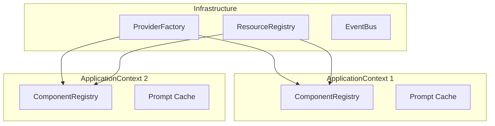

# ADR-0001: Модульная архитектура с разделение на Infrastructure и Application контексты

**Дата:** 2026-02-19  
**Статус:** Принято  
**Авторы:** Agent_v5 Team

---

## Контекст

При разработке системы агентов потребовалось обеспечить:
- Изоляцию между агентами
- Общие инфраструктурные ресурсы
- Масштабируемость на несколько агентов
- Тестируемость компонентов

## Решение

Разделить контекст системы на два уровня:

### InfrastructureContext
Общий для всех агентов:
- ProviderFactory (LLM, DB провайдеры)
- ResourceRegistry
- EventBus
- MetricsCollector
- LogCollector

### ApplicationContext
Изолированный на каждого агента:
- ComponentRegistry (сервисы, навыки, инструменты)
- Isolated caches (промпты, контракты)
- ComponentConfig

## Последствия

### Положительные
- Четкое разделение ответственности
- Возможность запуска нескольких агентов параллельно
- Упрощение тестирования через изоляцию
- Снижение coupling между компонентами

### Отрицательные
- Усложнение инициализации
- Необходимость управления двумя контекстами
- Дополнительная документация для разработчиков

## Ссылки

- `core/infrastructure/context/infrastructure_context.py`
- `core/application/context/application_context.py`
- `docs/architecture.md`
