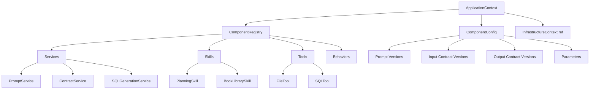

# 🏢 ApplicationContext

> **Версия:** 5.1.0
> **Дата обновления:** 2026-02-17
> **Статус:** approved
> **Владелец:** @system

---

## 📋 Оглавление

- [Обзор](#-обзор)
- [Назначение](#-назначение)
- [Профили](#-профили)
- [Архитектура](#-архитектура)
- [Инициализация](#-инициализация)
- [Использование](#-использование)
- [Множественные контексты](#-множественные-контексты)
- [Сравнение профилей](#-сравнение-профилей)

---

## 🔍 Обзор

**ApplicationContext** — изолированный контекст приложения, который создаётся **для каждого агента** и содержит его персональную конфигурацию, кэши и компоненты.

### Ключевые особенности

- ✅ **Изоляция** — каждый агент имеет собственный контекст
- ✅ **Два профиля** — `prod` (продакшен) и `sandbox` (песочница)
- ✅ **Гибкость** — можно создать несколько контекстов с разными настройками
- ✅ **Безопасность** — разные уровни доступа для разных профилей
- ✅ **Масштабируемость** — поддержка множества агентов параллельно

---

## 🎯 Назначение

### Проблема

Без ApplicationContext все агенты использовали бы:
- Одинаковые конфигурации
- Общие кэши промптов
- Одинаковые версии компонентов
- Одинаковые права доступа

**Результат:** Невозможно запустить A/B тестирование, нет изоляции между агентами.

### Решение

ApplicationContext создаётся **для каждого агента** с персональными настройками:

```
┌─────────────────────────────────────────────────────────┐
│         InfrastructureContext (1 экземпляр)              │
│  ┌─────────────┐  ┌─────────────┐  ┌─────────────────┐ │
│  │ LLM Models  │  │   Database  │  │  ResourceRegistry│ │
│  │   (shared)  │  │   (pool)    │  │    (shared)     │ │
│  └─────────────┘  └─────────────┘  └─────────────────┘ │
└─────────────────────────────────────────────────────────┘
           │                    │                    │
           ▼                    ▼                    ▼
    ┌──────────────┐   ┌──────────────┐   ┌──────────────┐
    │ ApplicationContext 1           │   │ ApplicationContext 2           │
    │ Profile: prod                │   │ Profile: sandbox               │
    │ ┌──────────────────────────┐ │   │ ┌──────────────────────────┐ │
    │ │ ComponentConfig          │ │   │ │ ComponentConfig          │ │
    │ │ - prompt_versions: v1.0  │ │   │ │ - prompt_versions: v2.0  │ │
    │ │ - status: active         │ │   │ │ - status: draft          │ │
    │ │ - sandbox: false         │ │   │ │ - sandbox: true          │ │
    │ └──────────────────────────┘ │   │ └──────────────────────────┘ │
    │ ┌──────────────────────────┐ │   │ ┌──────────────────────────┐ │
    │ │ Cached Prompts           │ │   │ │ Cached Prompts           │ │
    │ │ (isolated)               │ │   │ │ (isolated)               │ │
    │ └──────────────────────────┘ │   │ └──────────────────────────┘ │
    └──────────────┘   └──────────────┘   └──────────────┘
           │                    │
           ▼                    ▼
    ┌──────────────┐   ┌──────────────┐
    │   Agent 1    │   │   Agent 2    │
    │ Production   │   │   Testing    │
    └──────────────┘   └──────────────┘
```

---

## 🔄 Профили

### Профиль `prod` (продакшен)

**Назначение:** Работа в production-окружении с реальными данными и побочными эффектами.

```python
app_context = ApplicationContext(
    infrastructure_context,
    profile="prod"
)
```

**Характеристики:**
- ✅ **Только active версии** — принимает только стабильные версии промптов и контрактов
- ✅ **Побочные эффекты разрешены** — запись в БД, файловые операции, API-вызовы
- ✅ **Полная валидация** — строгая проверка входных/выходных данных
- ✅ **Логирование INFO** — только важная информация
- ✅ **Минимальные права** — доступ только к production-ресурсам

**Использование:**
- Обработка реальных запросов пользователей
- Работа с production-базой данных
- Выполнение финансовых операций
- Отправка уведомлений пользователям

**Пример конфигурации:**
```yaml
# registry.yaml
profile: prod

services:
  sql_query_service:
    enabled: true
    prompt_versions:
      sql_query_service.execute: v1.0.0  # Только active версии!
    input_contract_versions:
      sql_query_service.execute: v1.0.0
    status: active  # Обязательно active
```

---

### Профиль `sandbox` (песочница)

**Назначение:** Тестирование новых версий, отладка, эксперименты без риска для production.

```python
app_context = ApplicationContext(
    infrastructure_context,
    profile="sandbox"
)
```

**Характеристики:**
- ✅ **Все версии** — принимает active, draft, experimental версии
- ✅ **Побочные эффекты заблокированы** — запись в БД блокируется, файлы в temp
- ✅ **A/B тестирование** — можно использовать разные версии компонентов
- ✅ **Логирование DEBUG** — полная отладочная информация
- ✅ **Расширенные права** — доступ к тестовым ресурсам

**Использование:**
- Тестирование новых версий промптов
- Отладка логики компонентов
- A/B тестирование алгоритмов
- Обучение и демонстрации

**Пример конфигурации:**
```yaml
# registry.yaml
profile: sandbox

services:
  sql_query_service:
    enabled: true
    prompt_versions:
      sql_query_service.execute: v2.0.0-draft  # Можно draft версии!
    input_contract_versions:
      sql_query_service.execute: v2.0.0-draft
    status: draft  # Разрешены draft и experimental
    overrides:
      max_retries: 10  # Переопределение параметров
```

---

## 🏛️ Архитектура

### Диаграмма компонентов



### Структура контекста

```python
class ApplicationContext:
    def __init__(
        self,
        infrastructure_context: InfrastructureContext,
        profile: str = "prod",
        config_overrides: Optional[Dict] = None
    ):
        # Ссылка на общий InfrastructureContext (read-only)
        self._infrastructure_context = infrastructure_context
        
        # Профиль (prod или sandbox)
        self._profile = profile
        
        # Персональная конфигурация
        self._config = self._load_config(profile, config_overrides)
        
        # Реестр компонентов
        self._component_registry = ComponentRegistry()
        
        # Изолированные кэши
        self._prompt_cache: Dict[str, str] = {}
        self._contract_cache: Dict[str, Dict] = {}
        
        # Флаг sandbox
        self._sandbox = profile == "sandbox"
```

---

## 🚀 Инициализация

### Базовая инициализация

```python
from core.application.context.application_context import ApplicationContext

# 1. Создание InfrastructureContext (один раз)
infra_context = await InfrastructureContext.create(config)

# 2. Создание ApplicationContext для агента
app_context = ApplicationContext(
    infrastructure_context=infra_context,
    profile="prod"
)

# 3. Инициализация компонентов
await app_context.initialize_components()
```

### Инициализация с переопределением

```python
# Переопределение параметров для конкретного агента
config_overrides = {
    "max_steps": 20,  # Увеличенное количество шагов
    "timeout": 600,   # Увеличенный таймаут
    "services": {
        "sql_generation_service": {
            "max_retries": 5,  # Больше попыток
            "temperature": 0.7  # Другая температура
        }
    }
}

app_context = ApplicationContext(
    infrastructure_context=infra_context,
    profile="prod",
    config_overrides=config_overrides
)
```

### Время инициализации

| Этап | Время | Примечание |
|------|-------|------------|
| Создание объекта | ~1 мс | Выделение памяти |
| Загрузка конфигурации | ~10 мс | YAML парсинг |
| Инициализация компонентов | ~50 мс | Предзагрузка промптов |
| **Итого** | **~60 мс** | Для каждого агента |

---

## 💡 Использование

### Базовый пример

```python
from core.application.context.application_context import ApplicationContext

# Создание контекста
app_context = ApplicationContext(
    infrastructure_context=infra_context,
    profile="prod"
)

# Получение компонента
service = app_context.get_service("sql_generation_service")

# Выполнение
result = await service.generate_query(
    natural_language="Покажи всех пользователей",
    schema=db_schema
)
```

### Доступ к ресурсам

```python
# Получение промта из кэша
prompt = app_context.get_prompt("planning.create_plan")

# Получение контракта
input_schema = app_context.get_input_contract("sql_generation.generate_query")
output_schema = app_context.get_output_contract("sql_generation.generate_query")

# Валидация
app_context.validate_input("sql_generation.generate_query", params)
app_context.validate_output("sql_generation.generate_query", result)
```

### Проверка профиля

```python
# Проверка текущего профиля
if app_context.is_sandbox:
    # Sandbox-логика
    logger.debug("Sandbox mode: побочные эффекты заблокированы")
    result = await self._execute_sandbox(action)
else:
    # Production-логика
    logger.info("Production mode: выполнение действия")
    result = await self._execute_production(action)
```

---

## 🔄 Множественные контексты

### Сценарий 1: A/B тестирование

```python
# Агент A с версией 1.0
app_context_a = ApplicationContext(
    infrastructure_context=infra_context,
    profile="sandbox",
    config_overrides={
        "services": {
            "sql_generation_service": {
                "prompt_versions": {"execute": "v1.0.0"}
            }
        }
    }
)

# Агент B с версией 2.0
app_context_b = ApplicationContext(
    infrastructure_context=infra_context,
    profile="sandbox",
    config_overrides={
        "services": {
            "sql_generation_service": {
                "prompt_versions": {"execute": "v2.0.0-draft"}
            }
        }
    }
)

# Запуск обоих агентов с одинаковыми данными
results_a = await run_agent(app_context_a, test_query)
results_b = await run_agent(app_context_b, test_query)

# Сравнение результатов
compare_results(results_a, results_b)
```

### Сценарий 2: Разные задачи

```python
# Агент для аналитики (чтение)
analytics_context = ApplicationContext(
    infrastructure_context=infra_context,
    profile="prod",
    config_overrides={
        "max_steps": 50,  # Больше шагов для сложной аналитики
        "services": {
            "sql_query_service": {"enabled": True},
            "sql_generation_service": {"enabled": True}
        }
    }
)

# Агент для уведомлений (запись)
notification_context = ApplicationContext(
    infrastructure_context=infra_context,
    profile="prod",
    config_overrides={
        "max_steps": 10,  # Меньше шагов
        "services": {
            "email_service": {"enabled": True},
            "sms_service": {"enabled": True}
        }
    }
)

# Агент для тестирования
test_context = ApplicationContext(
    infrastructure_context=infra_context,
    profile="sandbox",  # Sandbox для безопасности
    config_overrides={
        "max_steps": 5,
        "services": {
            "mock_service": {"enabled": True}
        }
    }
)
```

### Сценарий 3: Параллельное выполнение

```python
import asyncio

# Создание 10 агентов с разными конфигурациями
agents = []
for i in range(10):
    ctx = ApplicationContext(
        infrastructure_context=infra_context,
        profile="prod",
        config_overrides={
            "agent_id": f"agent_{i}",
            "max_steps": 10 + i  # Разное количество шагов
        }
    )
    agents.append(create_agent(ctx))

# Параллельное выполнение
results = await asyncio.gather(*[agent.run(query) for agent in agents])
```

---

## 📊 Сравнение профилей

### Таблица сравнения

| Характеристика | `prod` | `sandbox` |
|----------------|--------|-----------|
| **Доступные версии** | Только `active` | Все (`active`, `draft`, `experimental`) |
| **Побочные эффекты** | ✅ Разрешены | ❌ Заблокированы |
| **Запись в БД** | ✅ Разрешена | ❌ Блокируется (mock) |
| **Файловые операции** | ✅ В production-директории | ⚠️ Только в temp |
| **API-вызовы** | ✅ Разрешены | ⚠️ Mock-режим |
| **Логирование** | INFO | DEBUG |
| **Валидация** | Строгая | Расширенная (с подсказками) |
| **A/B тестирование** | ❌ Недоступно | ✅ Доступно |
| **Переопределения** | ❌ Запрещены | ✅ Разрешены |
| **Изоляция** | Стандартная | Усиленная |

### Примеры использования

| Задача | Профиль | Обоснование |
|--------|---------|-------------|
| Обработка заказов | `prod` | Требует записи в БД |
| Тестирование нового промпта | `sandbox` | Безопасно, можно откатить |
| A/B тестирование алгоритма | `sandbox` | Нужно сравнение версий |
| Финансовые операции | `prod` | Только active версии, аудит |
| Демонстрация клиенту | `sandbox` | Без риска для данных |
| Нагрузочное тестирование | `sandbox` | Mock-режим для внешних API |

---

## 🔐 Безопасность

### Изоляция между контекстами

```python
# Каждый контекст имеет изолированные кэши
ctx1 = ApplicationContext(infra_context, profile="prod")
ctx2 = ApplicationContext(infra_context, profile="sandbox")

# Кэши не пересекаются
assert ctx1._prompt_cache is not ctx2._prompt_cache

# Изменение в одном контексте не влияет на другой
ctx1._prompt_cache["prompt"] = "value1"
assert ctx2._prompt_cache.get("prompt") is None  # None!
```

### Защита sandbox

```python
class FileTool(BaseTool):
    async def write_file(self, path: str, content: str) -> None:
        if self.application_context.is_sandbox:
            # В sandbox запись только в temp
            safe_path = self._get_sandbox_temp_path(path)
            logger.warning(f"Sandbox mode: запись в {safe_path}")
        else:
            # В prod запись в указанное место
            safe_path = self._validate_path(path)
        
        await self._write(safe_path, content)
```

---

## 🔗 Ссылки

- [InfrastructureContext](./infrastructure_context.md)
- [ComponentConfig](../../core/config/component_config.py)
- [Профили безопасности](../../docs/architecture/security-model.md)

---

*Документ автоматически поддерживается в актуальном состоянии*
