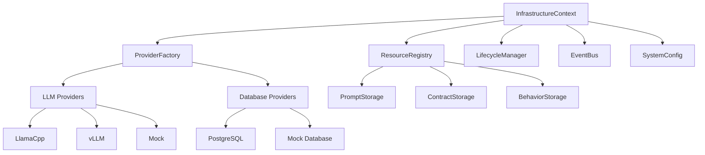
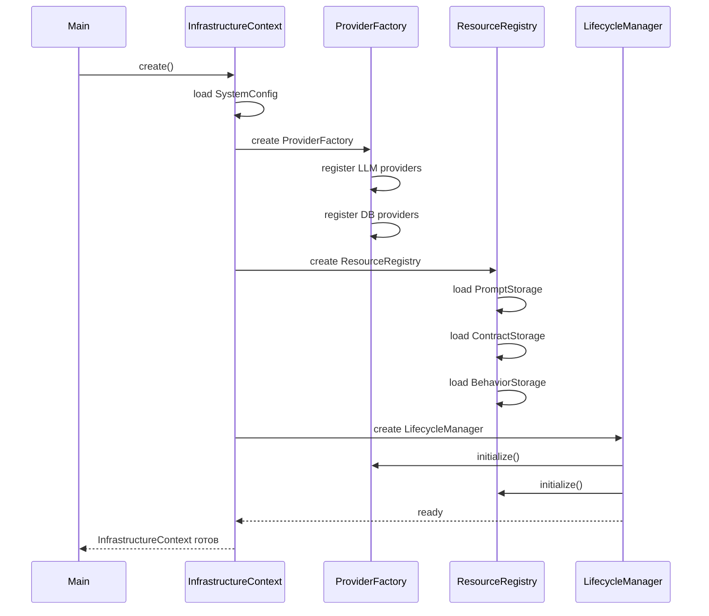

# 🏗️ InfrastructureContext

> **Версия:** 5.1.0
> **Дата обновления:** 2026-02-17
> **Статус:** approved
> **Владелец:** @system

---

## 📋 Оглавление

- [Обзор](#-обзор)
- [Назначение](#-назначение)
- [Архитектура](#-архитектура)
- [Компоненты](#-компоненты)
- [Инициализация](#-инициализация)
- [Использование](#-использование)
- [Примеры](#-примеры)

---

## 🔍 Обзор

**InfrastructureContext** — общий контекст инфраструктуры, который создаётся **один раз** при запуске приложения и содержит все тяжёлые ресурсы, общие для всех агентов.

### Ключевые особенности

- ✅ **Единый экземпляр** — создаётся один на всё приложение
- ✅ **Тяжёлые ресурсы** — содержит LLM-модели, подключения к БД
- ✅ **Общий доступ** — все агенты используют одни и те же ресурсы
- ✅ **Экономия памяти** — нет дублирования моделей и подключений
- ✅ **Централизованное управление** — жизненный цикл ресурсов в одном месте

---

## 🎯 Назначение

### Проблема

Без InfrastructureContext каждый агент создавал бы собственные:
- Подключения к базе данных
- LLM-модели (которые занимают гигабайты памяти)
- Кэши промптов и контрактов
- Шину событий

**Результат:** При 10 агентах — 10 подключений к БД, 10 копий моделей LLM, ~4.2 ГБ памяти.

### Решение

InfrastructureContext создаётся **один раз** и предоставляет ресурсы всем агентам:

```
┌───────────────────────────────────────────┐
│    InfrastructureContext (1 экземпляр)    │
│  ┌─────────┐  ┌──────────┐  ┌──────────┐ │
│  │   LLM   │  │    DB    │  │  Cache   │ │
│  │ Models  │  │  (pool)  │  │ (shared) │ │
│  └─────────┘  └──────────┘  └──────────┘ │
└───────────────────────────────────────────┘
         │           │            │
         └───────────┴────────────┘
                     │
         ┌───────────┼───────────┐
         │           │           │
         ▼           ▼           ▼
    ┌─────────┐ ┌─────────┐ ┌─────────┐
    │ Agent 1 │ │ Agent 2 │ │ Agent 3 │
    │ AppCtx  │ │ AppCtx  │ │ AppCtx  │
    └─────────┘ └─────────┘ └─────────┘
```

**Результат:** 1 подключение к БД (пул), 1 копия моделей LLM, ~1.2 ГБ памяти для 10 агентов.

---

## 🏛️ Архитектура

### Диаграмма компонентов



### Слои доступа

```
┌──────────────────────────────────────┐
│  Приложения (ApplicationContext)     │
│  ┌────────┐  ┌────────┐  ┌────────┐ │
│  │ Agent 1│  │ Agent 2│  │ Agent 3│ │
│  └────────┘  └────────┘  └────────┘ │
└──────────────────────────────────────┘
                 │ read-only
                 ▼
┌──────────────────────────────────────┐
│     InfrastructureContext            │
│  ┌────────────────────────────────┐  │
│  │   ProviderFactory              │  │
│  │   ResourceRegistry             │  │
│  │   LifecycleManager             │  │
│  │   EventBus                     │  │
│  └────────────────────────────────┘  │
└──────────────────────────────────────┘
                 │
                 ▼
┌──────────────────────────────────────┐
│     Физические ресурсы               │
│  ┌────────┐  ┌────────┐  ┌────────┐ │
│  │  LLM   │  │   DB   │  │  FS    │ │
│  └────────┘  └────────┘  └────────┘ │
└──────────────────────────────────────┘
```

---

## 🧩 Компоненты

### ProviderFactory

**Назначение:** Фабрика для создания и управления провайдерами.

```python
class ProviderFactory:
    def __init__(self, config: SystemConfig):
        self.config = config
        self._providers: Dict[str, Any] = {}
    
    def get_llm_provider(self) -> BaseLLM:
        """Получение LLM-провайдера (singleton)"""
        if 'llm' not in self._providers:
            self._providers['llm'] = self._create_llm_provider()
        return self._providers['llm']
    
    def get_db_provider(self) -> BaseDatabase:
        """Получение провайдера БД (singleton)"""
        if 'db' not in self._providers:
            self._providers['db'] = self._create_db_provider()
        return self._providers['db']
```

**Провайдеры:**
- **LLM:** LlamaCpp, vLLM, OpenAI, Mock
- **Database:** PostgreSQL, SQLite, Mock

### ResourceRegistry

**Назначение:** Реестр ресурсов (промты, контракты, паттерны).

```python
class ResourceRegistry:
    def __init__(self):
        self._prompt_storage: IPromptStorage = None
        self._contract_storage: IContractStorage = None
        self._behavior_storage: IBehaviorStorage = None
    
    async def initialize(self, config: SystemConfig):
        """Предзагрузка всех ресурсов"""
        self._prompt_storage = await self._load_prompts()
        self._contract_storage = await self._load_contracts()
        self._behavior_storage = await self._load_behaviors()
    
    def get_prompt(self, name: str, version: str) -> Prompt:
        """Получение промта по имени и версии"""
        return self._prompt_storage.get(name, version)
```

**Хранилища:**
- **PromptStorage:** Промпты для всех компонентов
- **ContractStorage:** Схемы входных/выходных контрактов
- **BehaviorStorage:** Паттерны поведения

### LifecycleManager

**Назначение:** Управление жизненным циклом ресурсов.

```python
class LifecycleManager:
    def __init__(self, providers: Dict[str, Any]):
        self.providers = providers
        self._initialized = False
    
    async def initialize(self):
        """Инициализация всех ресурсов"""
        for provider in self.providers.values():
            await provider.initialize()
        self._initialized = True
    
    async def shutdown(self):
        """Корректное завершение работы"""
        for provider in self.providers.values():
            await provider.shutdown()
        self._initialized = False
```

**Методы:**
- `initialize()` — инициализация всех провайдеров
- `shutdown()` — корректное завершение работы
- `health_check()` — проверка работоспособности

### EventBus

**Назначение:** Шина событий для межкомпонентной коммуникации.

```python
class EventBus:
    def __init__(self):
        self._handlers: Dict[str, List[Callable]] = {}
    
    def subscribe(self, event_type: str, handler: Callable):
        """Подписка на событие"""
        if event_type not in self._handlers:
            self._handlers[event_type] = []
        self._handlers[event_type].append(handler)
    
    async def publish(self, event_type: str, data: Any):
        """Публикация события"""
        if event_type in self._handlers:
            for handler in self._handlers[event_type]:
                await handler(data)
```

**События:**
- `component.initialized` — компонент инициализирован
- `component.error` — ошибка компонента
- `agent.started` — агент начал работу
- `agent.completed` — агент завершил работу

---

## 🚀 Инициализация

### Пошаговый процесс



### Код инициализации

```python
from core.infrastructure.context.infrastructure_context import InfrastructureContext
from core.config import get_config

async def main():
    # 1. Загрузка конфигурации
    config = get_config(profile="prod")
    
    # 2. Создание InfrastructureContext (один раз!)
    infrastructure_context = await InfrastructureContext.create(config)
    
    # 3. Использование для создания агентов
    for i in range(10):
        app_context = ApplicationContext(infrastructure_context)
        agent = await create_agent(app_context)
    
    # 4. Корректное завершение
    await infrastructure_context.shutdown()
```

### Время инициализации

| Этап | Время | Примечание |
|------|-------|------------|
| Загрузка конфигурации | ~10 мс | YAML парсинг |
| Создание ProviderFactory | ~50 мс | Регистрация провайдеров |
| Загрузка LLM-модели | ~800 мс | **Самая долгая операция** |
| Загрузка ресурсов | ~200 мс | Промпты, контракты |
| Инициализация БД | ~50 мс | Подключение к PostgreSQL |
| **Итого** | **~1100 мс** | Один раз при старте |

---

## 💡 Использование

### Базовый пример

```python
from core.infrastructure.context.infrastructure_context import InfrastructureContext
from core.application.context.application_context import ApplicationContext

# Создание InfrastructureContext (ОДИН РАЗ!)
infra_context = await InfrastructureContext.create(config)

# Создание нескольких ApplicationContext
app_context_1 = ApplicationContext(infra_context)
app_context_2 = ApplicationContext(infra_context)
app_context_3 = ApplicationContext(infra_context)

# Все используют одни и те же ресурсы!
assert app_context_1.infrastructure_context is infra_context
assert app_context_2.infrastructure_context is infra_context
```

### Получение ресурсов

```python
# Через InfrastructureContext
llm_provider = infrastructure_context.provider_factory.get_llm_provider()
db_provider = infrastructure_context.provider_factory.get_db_provider()

prompt = infrastructure_context.resource_registry.get_prompt(
    "planning.create_plan", 
    "v1.0.0"
)

# Через ApplicationContext (read-only)
llm_provider = app_context.infrastructure_context.provider_factory.get_llm_provider()
```

### Мониторинг ресурсов

```python
# Проверка состояния
health = await infrastructure_context.lifecycle_manager.health_check()

if not health.is_healthy:
    print(f"Unhealthy components: {health.unhealthy_components}")

# Метрики
metrics = infrastructure_context.get_metrics()
print(f"LLM memory: {metrics.llm_memory_gb} GB")
print(f"DB connections: {metrics.db_active_connections}")
print(f"Cache hit rate: {metrics.cache_hit_rate}%")
```

---

## 📊 Экономия ресурсов

### Память

| Сценарий | Без InfrastructureContext | С InfrastructureContext | Экономия |
|----------|--------------------------|------------------------|----------|
| 1 агент | ~400 МБ | ~400 МБ | 0% |
| 5 агентов | ~2.0 ГБ | ~800 МБ | 60% |
| 10 агентов | ~4.0 ГБ | ~1.2 ГБ | 70% |
| 50 агентов | ~20.0 ГБ | ~3.0 ГБ | 85% |

### Подключения к БД

| Сценарий | Без InfrastructureContext | С InfrastructureContext |
|----------|--------------------------|------------------------|
| 1 агент | 1 подключение | 1 подключение (пул) |
| 10 агентов | 10 подключений | 1 пул (5 подключений) |
| 50 агентов | 50 подключений | 1 пул (10 подключений) |

### Время инициализации

| Сценарий | Без InfrastructureContext | С InfrastructureContext |
|----------|--------------------------|------------------------|
| 1 агент | ~1100 мс | ~1100 мс |
| 10 агентов | ~11000 мс | ~1100 мс |
| 50 агентов | ~55000 мс | ~1100 мс |

---

## 🔐 Безопасность

### Изоляция доступа

```python
# ApplicationContext имеет ТОЛЬКО чтение
class ApplicationContext:
    def __init__(self, infrastructure_context: InfrastructureContext):
        # Read-only ссылка
        self._infrastructure_context = infrastructure_context
    
    @property
    def infrastructure_context(self) -> InfrastructureContext:
        return self._infrastructure_context  # Без setter!
```

### Защита от модификации

```python
# Попытка модификации вызовет ошибку
app_context.infrastructure_context = new_context  # AttributeError!

# Правильный способ — создание нового InfrastructureContext
new_infra_context = await InfrastructureContext.create(config)
new_app_context = ApplicationContext(new_infra_context)
```

---

## 🔗 Ссылки

- [ApplicationContext](./application_context.md)
- [SystemConfig](../../core/config/system_config.py)
- [ProviderFactory](../../core/infrastructure/providers/factory.py)

---

*Документ автоматически поддерживается в актуальном состоянии*
