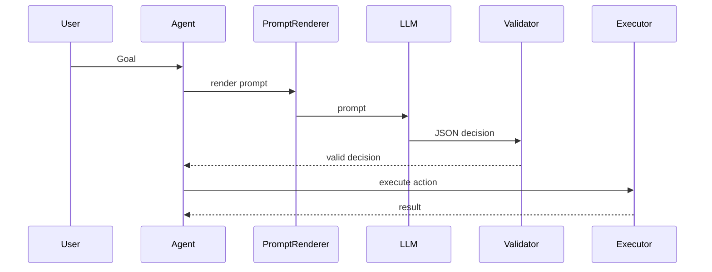

# Поток принятия решений

```mermaid
sequenceDiagram
    participant User
    participant Agent
    participant PromptRenderer
    participant LLM
    participant Validator
    participant Executor

    User->>Agent: Goal
    Agent->>PromptRenderer: render prompt
    PromptRenderer->>LLM: prompt
    LLM->>Validator: JSON decision
    Validator-->>Agent: valid decision
    Agent->>Executor: execute action
    Executor-->>Agent: result
```
